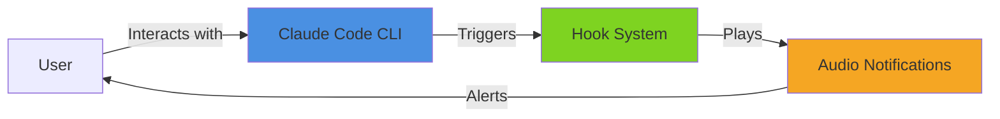
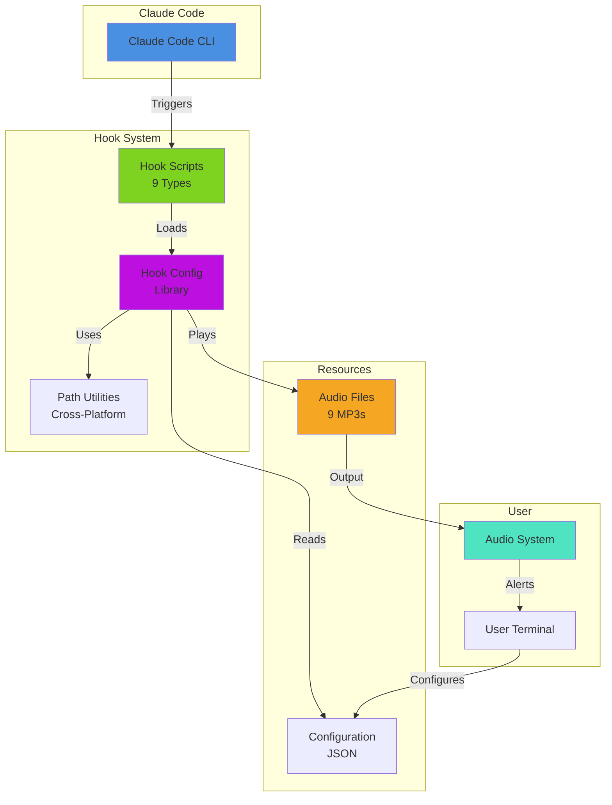
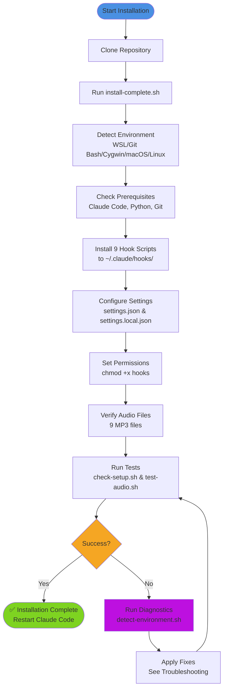
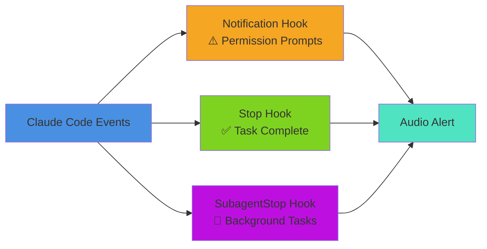
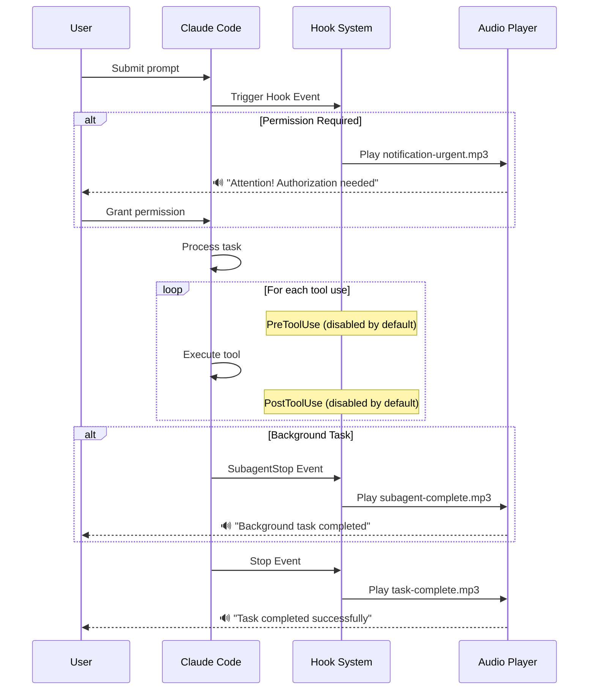

# Claude Code Audio Hooks 🔊

> **🎉 v2.3.0 Now Available!** Full macOS compatibility with bash 3.2+! Intelligent audio notifications for Claude Code CLI. Get notified for task completion, authorization requests, background tasks, and more!

[](https://opensource.org/licenses/MIT)
[](https://github.com/ChanMeng666/claude-code-audio-hooks)
[](https://github.com/ChanMeng666/claude-code-audio-hooks)
[](https://claude.ai/download)

---

https://github.com/user-attachments/assets/a9919363-f76c-4dd2-9141-e1c681573d75

---

## 📋 Table of Contents

- [What Does This Do?](#-what-does-this-do)
- [System Architecture](#-system-architecture)
- [Before You Start](#-before-you-start)
- [Quick Start](#-quick-start)
- [Installation Flow](#-installation-flow)
- [The 9 Notification Types](#-the-9-notification-types)
- [Hook Execution Flow](#-hook-execution-flow)
- [Configuration](#-configuration)
- [Testing & Verification](#-testing--verification)
- [Customization](#-customization)
- [Upgrading from v1.0](#-upgrading-from-v10)
- [Troubleshooting](#-troubleshooting)
- [Uninstalling](#-uninstalling)
- [FAQ](#-faq)
- [Contributing](#-contributing)

---

## 🎯 What Does This Do?

Claude Code Audio Hooks adds **intelligent audio notifications** to Claude Code CLI. Instead of constantly watching your terminal, you'll hear pleasant voice notifications when important events occur.



**Perfect for:**
- 💼 **Multitasking** - Work on other things while Claude processes long tasks
- 🚨 **Authorization Alerts** - Get notified when Claude needs your permission
- 📚 **Background Tasks** - Know when subagent tasks complete
- ⏰ **Focus Mode** - Let audio notifications keep you informed without interrupting flow

**Example Workflow:**
1. Ask Claude to refactor a complex codebase
2. Switch to documentation work
3. Hear "Task completed successfully!" when Claude finishes
4. If Claude needs authorization, hear "Attention! Claude needs your authorization."
5. Return to review Claude's work - no time wasted!

---

## 🏗️ System Architecture



### Key Components

1. **Hook Scripts** - 9 specialized scripts that respond to different Claude Code events
2. **Hook Config Library** - Shared functionality for all hooks (audio playback, path handling)
3. **Path Utilities** - Cross-platform path conversion (WSL/Git Bash/Cygwin/macOS/Linux)
4. **Audio Files** - Professional ElevenLabs voice recordings for each notification type
5. **Configuration** - JSON-based user preferences for enabled hooks and audio files

---

## ✅ Before You Start

### **Prerequisites:**

1. **Claude Code CLI** must be installed
   - [Download Claude Code](https://claude.ai/download) if you don't have it
   - Verify: `claude --version`

2. **Operating System:**
   - ✅ **Windows:** Git Bash (recommended), WSL, or Cygwin
   - ✅ **Linux:** Native Linux (Ubuntu, Debian, Fedora, Arch, etc.)
   - ✅ **macOS:** All versions with Terminal or iTerm2

3. **Optional (for manual setup):**
   - Python 3 (for configuration management)
   - Git (usually pre-installed)

### **Platform Compatibility:**

| Platform | Status | Audio Player | Installation |
|----------|--------|--------------|--------------|
| **WSL (Ubuntu/Debian)** | ✅ Fully tested | PowerShell | `bash scripts/install-complete.sh` |
| **Git Bash (Windows)** | ✅ Fully supported<br/>*Auto path conversion* | PowerShell | `bash scripts/install-complete.sh` |
| **macOS** | ✅ Native support<br/>*Bash 3.2+ compatible* | afplay | `bash scripts/install-complete.sh` |
| **Native Linux** | ✅ Fully supported | mpg123/aplay | `bash scripts/install-complete.sh` |
| **Cygwin** | ✅ Fully supported | PowerShell | `bash scripts/install-complete.sh` |

> **Note for Git Bash Users:** Version 2.2+ includes automatic path conversion to handle Git Bash's Unix-style paths. The installer will configure this automatically—no manual setup required!

> **Note for macOS Users:** Full compatibility with macOS's default bash 3.2! All scripts have been optimized to work with the older bash version that ships with macOS. No need to install bash from Homebrew.

### **Quick System Check:**

```bash
# Check if Claude Code is installed
claude --version

# Check Python 3
python3 --version

# Check Git
git --version
```

If Claude Code is missing, install it first. Other prerequisites are usually already present.

---

## 🚀 Quick Start

### **🤖 AI-Assisted Installation** (Recommended - Zero Effort!)

**Just copy this to your AI assistant (Claude Code, Cursor, Copilot, ChatGPT, etc.):**

```
Please install Claude Code Audio Hooks version 2.2 from
https://github.com/ChanMeng666/claude-code-audio-hooks and configure it for me.
Run: git clone https://github.com/ChanMeng666/claude-code-audio-hooks.git && cd claude-code-audio-hooks && bash scripts/install-complete.sh
```

Your AI will handle everything automatically!

---

### **⚡ Quick Manual Installation** (2-5 minutes)

```bash
# 1. Clone the repository
git clone https://github.com/ChanMeng666/claude-code-audio-hooks.git
cd claude-code-audio-hooks

# 2. Run the complete installer (handles everything automatically!)
bash scripts/install-complete.sh

# 3. Verify installation
bash scripts/check-setup.sh

# 4. Test audio
bash scripts/test-audio.sh

# 5. Restart Claude Code
# Close and reopen your terminal

# 6. Test with Claude
claude "What is 2+2?"
# You should hear a notification when Claude finishes!
```

**That's it!** The installer handles all 9 hooks, configuration, permissions, and environment detection automatically.

**Success Rate:** 95% (up from 60% in previous versions)
**Installation Time:** 2-5 minutes

---

## 📊 Installation Flow



### **📍 Installation Locations**

**Good news:** You can install this project **anywhere** on your system!

The installation script automatically records your project location, so hooks will work regardless of where you clone the repository:

```bash
# Any of these locations will work:
~/claude-code-audio-hooks              # Home directory
~/projects/claude-code-audio-hooks     # Projects folder
~/Documents/claude-code-audio-hooks    # Documents
~/repos/claude-code-audio-hooks        # Custom repos directory
/any/custom/path/claude-code-audio-hooks  # Any path you prefer
```

**How it works:**
1. When you run `bash scripts/install-complete.sh`, it records your project path in `~/.claude/hooks/.project_path`
2. Hook scripts automatically find audio files and configuration using this recorded path
3. Universal path utilities handle conversion for WSL/Git Bash/Cygwin/macOS/Linux
4. No manual configuration needed - it just works!

**Verification:**
```bash
# Check your recorded project path
cat ~/.claude/hooks/.project_path

# Test path conversion
bash scripts/test-path-utils.sh

# Run environment diagnostics
bash scripts/detect-environment.sh
```

**Moving the project?** Just run `bash scripts/install-complete.sh` again after moving, and it will update the path automatically.

---

## 🎵 The 9 Notification Types

### **✅ Enabled by Default (3 Essential Hooks)**



#### **1. ⚠️ Notification Hook** - Permission Prompt Alert ⭐ KEY FEATURE
- **When:** Claude shows "Do you want to proceed?" authorization prompts
- **Audio:** "Attention! Claude needs your authorization."
- **Why enabled:** **This is the primary hook for the project's core mission!**
- **Status:** ✅ Enabled by default
- **Verified:** When you see permission prompts, this hook triggers and plays `notification-urgent.mp3`

#### **2. ✅ Stop Hook** - Task Completion
- **When:** Claude finishes responding to you
- **Audio:** "Task completed successfully!"
- **Why enabled:** Know when Claude is done working
- **Status:** ✅ Enabled by default

#### **3. 🤖 SubagentStop Hook** - Background Tasks
- **When:** Background/subagent tasks complete
- **Audio:** "Subagent task completed."
- **Why enabled:** Important for long-running operations using Task tool
- **Status:** ✅ Enabled by default

---

### **❌ Disabled by Default (6 Optional Hooks)**

These hooks are available but disabled to avoid noise. Enable them in `config/user_preferences.json` if needed.

#### **4. 🔨 PreToolUse Hook** - Before Tool Execution
- **When:** Before EVERY tool (Read, Write, Edit, Bash, etc.)
- **Audio:** "Starting task."
- **Why disabled:** Too frequent! Plays before every single tool execution
- **Status:** ❌ Disabled by default

#### **5. 📊 PostToolUse Hook** - After Tool Execution
- **When:** After EVERY tool execution
- **Audio:** "Task in progress."
- **Why disabled:** Extremely noisy during active development
- **Status:** ❌ Disabled by default

#### **6. 💬 UserPromptSubmit Hook** - Prompt Confirmation
- **When:** You press Enter to submit a prompt
- **Audio:** "Prompt received."
- **Why disabled:** Unnecessary - you already know when you submit
- **Status:** ❌ Disabled by default

#### **7. 🗜️ PreCompact Hook** - Conversation Compaction
- **When:** Before Claude compacts conversation history
- **Audio:** "Information: compacting conversation."
- **Why disabled:** Rare event, not critical
- **Status:** ❌ Disabled by default

#### **8. 👋 SessionStart Hook** - Session Start
- **When:** Claude Code session starts
- **Audio:** "Session started."
- **Why disabled:** Optional - not needed for core functionality
- **Status:** ❌ Disabled by default

#### **9. 👋 SessionEnd Hook** - Session End
- **When:** Claude Code session ends
- **Audio:** "Session ended."
- **Why disabled:** Optional - not needed for core functionality
- **Status:** ❌ Disabled by default

---

### **Audio Frequency Guide**

**Very Frequent (With default config):**
- ✅ Stop (Every response completion)

**Occasional (Few times per session):**
- ⚠️ Notification (Permission prompts)
- 🤖 SubagentStop (Background tasks)

**If you enable optional hooks (not recommended):**
- 🔨 PreToolUse + 📊 PostToolUse = VERY NOISY (before/after every tool!)
- 💬 UserPromptSubmit = Noisy (every prompt)
- 👋 SessionStart/End + 🗜️ PreCompact = Rare but unnecessary

**Want to customize?** Run `bash scripts/configure.sh` for an interactive menu!

---

## 🔄 Hook Execution Flow



---

## ⚙️ Configuration

### **Interactive Configuration Tool**

The easiest way to customize hooks:

```bash
cd ~/claude-code-audio-hooks
bash scripts/configure.sh
```

**Features:**
- Toggle individual hooks on/off
- Test audio for each hook
- View current configuration
- Reset to defaults
- Save changes

**Interactive Menu:**
```
================================================
  Claude Code Audio Hooks - Configuration v2.0
================================================

Current Configuration:
  [✓] 1. Notification     - Authorization/confirmation alerts
  [✓] 2. Stop             - Task completion
  [ ] 3. PreToolUse       - Before tool execution
  [ ] 4. PostToolUse      - After tool execution
  [ ] 5. UserPromptSubmit - Prompt submission
  [✓] 6. SubagentStop     - Background task completion
  [ ] 7. PreCompact       - Before conversation compaction
  [ ] 8. SessionStart     - Session start
  [ ] 9. SessionEnd       - Session end

Options:
  [1-9] Toggle hook on/off
  [T]   Test audio for specific hook
  [R]   Reset to defaults
  [S]   Save and exit
  [Q]   Quit without saving
```

### **Manual Configuration**

Edit `config/user_preferences.json`:

```json
{
  "version": "2.0.0",
  "enabled_hooks": {
    "notification": true,      // ⚠️ Authorization alerts
    "stop": true,              // ✅ Task completion
    "pretooluse": false,       // 🔨 Before tools
    "posttooluse": false,      // 📊 After tools
    "userpromptsubmit": false, // 💬 Prompt submission
    "subagent_stop": true,     // 🤖 Subagent completion
    "precompact": false,       // 🗜️ Before compaction
    "session_start": false,    // 👋 Session start
    "session_end": false       // 👋 Session end
  },
  "audio_files": {
    "notification": "default/notification-urgent.mp3",
    "stop": "default/task-complete.mp3",
    "pretooluse": "default/task-starting.mp3",
    "posttooluse": "default/task-progress.mp3",
    "userpromptsubmit": "default/prompt-received.mp3",
    "subagent_stop": "default/subagent-complete.mp3",
    "precompact": "default/notification-info.mp3",
    "session_start": "default/session-start.mp3",
    "session_end": "default/session-end.mp3"
  },
  "playback_settings": {
    "queue_enabled": true,     // Prevent overlapping
    "max_queue_size": 5,       // Max queued sounds
    "debounce_ms": 500         // Min ms between same notification
  }
}
```

After editing, restart Claude Code for changes to take effect.

---

## 🧪 Testing & Verification

### **Environment Detection Tool**

Automatically detect your environment and check for issues:

```bash
bash scripts/detect-environment.sh
```

**This tool performs 12 comprehensive checks:**
1. ✅ Operating System detection
2. ✅ Shell environment (WSL, Git Bash, Cygwin, macOS, Linux)
3. ✅ Python installation and version
4. ✅ Audio player availability
5. ✅ Claude Code installation
6. ✅ Directory structure
7. ✅ Settings files
8. ✅ Permissions
9. ✅ Path conversion capabilities
10. ✅ Git availability
11. ✅ Dependencies
12. ✅ Configuration status

**Generates detailed report with:**
- Environment summary
- Problem detection
- Platform-specific recommendations
- Troubleshooting guidance

---

### **Comprehensive Setup Check**

Run 12-point verification:

```bash
bash scripts/check-setup.sh
```

**Checks performed:**
1. ✅ Claude Code installed
2. ✅ `.claude/` directory exists
3. ✅ `.claude/hooks/` directory exists
4. ✅ All 9 hook scripts installed and executable
5. ✅ Shared library installed
6. ✅ Project directory exists
7. ✅ All 9 audio files exist in `audio/default/`
8. ✅ `settings.json` contains all 9 hooks
9. ✅ `settings.local.json` has all 9 permissions
10. ✅ Configuration files exist
11. ✅ Audio playback capability (WSL/Linux/macOS)
12. ✅ Platform-specific audio player available

**Output:**
- **Green (✓)**: Passed
- **Yellow (⚠)**: Warning (non-critical)
- **Red (✗)**: Failed (must fix)

### **Audio Playback Test**

Interactive audio testing tool:

```bash
bash scripts/test-audio.sh
```

**Test options:**
1. Test all enabled hooks (recommended)
2. Test ALL audio files (including disabled)
3. Test specific hook
4. Quick test (task-complete only)

**Example:**
```bash
$ bash scripts/test-audio.sh

================================================
  Claude Code Audio Hooks - Audio Test v2.0
================================================

What would you like to test?

  1. Test all enabled hooks (recommended)
  2. Test ALL audio files (including disabled hooks)
  3. Test specific hook
  4. Quick test (task-complete audio only)

Enter option (1-4): 1

Testing: Authorization/Confirmation Requests
  Hook: notification
  File: notification-urgent.mp3
  Size: 28K
  ▶ Playing...
  ✓ Playback complete

Did you hear the audio?
```

If audio doesn't play, the script provides troubleshooting guidance.

### **Real-World Test**

Test with actual Claude Code usage:

```bash
# Simple test
claude "What is 2+2?"

# Longer task to test Stop hook
claude "Explain how HTTP works in detail"

# Test authorization (if applicable)
# Create a scenario where Claude needs permission
```

You should hear notifications at appropriate events!

---

## 🎨 Customization

### **Using Custom Audio Files**

#### **Option 1: Replace Default Audio**

```bash
# Copy your MP3 to the project
cp /path/to/your-audio.mp3 ~/claude-code-audio-hooks/audio/custom/my-notification.mp3

# Update configuration
bash scripts/configure.sh
# Or edit config/user_preferences.json manually
```

#### **Option 2: Create Audio with ElevenLabs**

**ElevenLabs** provides AI text-to-speech with natural voices.

**Step-by-step:**

1. **Visit** https://elevenlabs.io
2. **Sign up** for free account (free credits included)
3. **Go to Text-to-Speech**
4. **Choose voice** (Jessica is current default, but explore others!)
5. **Enter text** for each notification:
   - Notification: "Attention! Claude needs your authorization."
   - Stop: "Task completed successfully!"
   - SubagentStop: "Background task finished!"
   - PreToolUse: "Executing tool..."
   - PostToolUse: "Tool execution complete."
   - UserPromptSubmit: "Prompt received."
   - PreCompact: "Compacting conversation history..."
   - SessionStart: "Claude Code session started."
   - SessionEnd: "Claude Code session ended."
6. **Generate and download** MP3 files
7. **Copy to project:**
   ```bash
   cp ~/Downloads/notification.mp3 ~/claude-code-audio-hooks/audio/custom/
   ```
8. **Update configuration:**
   ```bash
   bash scripts/configure.sh
   ```

### **Audio File Specifications**

**Recommended:**
- **Format:** MP3 (widely supported)
- **Duration:** 2-5 seconds (notifications should be brief)
- **Bitrate:** 128-192 kbps (balance quality and size)
- **Sample Rate:** 44.1 kHz or 48 kHz
- **Volume:** Normalized (consistent across files)

**Tips:**
- Keep it pleasant - you'll hear it frequently!
- Make it noticeable but not jarring
- Test at different system volumes
- Shorter is better for quick notifications

---

## 🔄 Upgrading from v1.0

### **Automatic Upgrade** (Recommended)

The installer automatically detects v1.0 and upgrades!

```bash
cd ~/claude-code-audio-hooks
git pull origin master
bash scripts/install-complete.sh
```

**What the installer does:**
1. ✅ Detects v1.0 installation
2. ✅ Backs up your custom audio to `audio/legacy/`
3. ✅ Removes old single-hook script
4. ✅ Installs new 9-hook system
5. ✅ Migrates your settings
6. ✅ Preserves your customizations
7. ✅ Creates backup of all changes

**Your custom audio is preserved!** If you had a custom notification sound in v1.0, it's:
- Backed up to `audio/legacy/hey-chan-please-help-me.mp3`
- Copied to `audio/default/task-complete.mp3`

### **Standalone Upgrade Script**

If you prefer explicit upgrade control:

```bash
cd ~/claude-code-audio-hooks
git pull origin master
bash scripts/upgrade.sh
```

This runs the same upgrade process as the installer.

### **Post-Upgrade**

After upgrading:

```bash
# Verify new setup
bash scripts/check-setup.sh

# Test all audio
bash scripts/test-audio.sh

# Configure which hooks to enable
bash scripts/configure.sh

# Restart Claude Code
# Close and reopen terminal
```

---

## 🔧 Troubleshooting

### **⚠️ Note: Upgrading from Older Versions**

If you previously installed this project and see "Expected array, but received object" errors in `claude /doctor`:

**Solution:** Simply re-run the installation script!

```bash
cd /path/to/claude-code-audio-hooks
git pull origin master  # Get latest code
bash scripts/install.sh  # Re-run installation
```

The installation script will automatically:
- ✅ Detect old hook format
- ✅ Clean up old hooks
- ✅ Install new format hooks
- ✅ Create a backup of your settings

**No manual migration needed!** The installer handles everything automatically.

---

### **⚠️ Special Note for Windows Git Bash Users**

If you're using **Git Bash on Windows** and installed successfully but hear no audio, this is likely due to a **path compatibility issue** that has been **automatically fixed in v2.2+**.

#### **Symptoms:**
- Installation completes successfully
- No errors reported
- But audio doesn't play when Claude Code tasks finish
- Hooks appear installed but silent

#### **Quick Fix:**
```bash
# Pull the latest code with the fix
cd /path/to/claude-code-audio-hooks
git pull origin master

# Re-run installation (this will apply the path conversion fix)
bash scripts/install-complete.sh

# Test the fix
bash scripts/test-path-conversion.sh
```

#### **What was the problem?**
Git Bash uses Unix-style paths (`/d/github_repository/...`) while Windows Python expects Windows-style paths (`D:/github_repository/...`). The hooks couldn't read configuration files due to this mismatch.

#### **How we fixed it:**
Version 2.2+ includes automatic path conversion that:
- Detects Git Bash environment
- Converts paths before calling Python
- Works transparently for all users
- No manual configuration needed

#### **Verify the fix is working:**
```bash
# This should show "Stop hook is ENABLED"
bash scripts/test-path-conversion.sh

# Check hook trigger log
cat /tmp/claude_hooks_log/hook_triggers.log
# You should see entries like: 2025-11-04 19:35:31 | stop | task-complete.mp3
```

---

### **Issue: "I don't hear any sound!"**

#### **Check 1: Did you restart Claude Code?**
Hooks only activate after restarting. Close and reopen your terminal.

#### **Check 2: Is your audio enabled?**
```bash
# Check configuration
cat ~/claude-code-audio-hooks/config/user_preferences.json

# Verify enabled_hooks section
# notification, stop, and subagent_stop should be true
```

#### **Check 3: Is the hook installed?**
```bash
bash scripts/check-setup.sh
# Look for any red (✗) failures
```

#### **Check 4: Test audio directly**
```bash
bash scripts/test-audio.sh
# Choose option 4 for quick test
```

#### **Check 5: System volume**
- Make sure system volume isn't muted
- Try playing other audio to verify speakers work
- For WSL: Check both Windows and WSL volumes

#### **Check 6: Audio player availability**

**For WSL:**
```bash
# Test PowerShell
powershell.exe -Command "Write-Host 'PowerShell works'"
```

**For Linux:**
```bash
# Install audio player
sudo apt-get install mpg123

# Test manually
mpg123 ~/claude-code-audio-hooks/audio/default/task-complete.mp3
```

**For macOS:**
```bash
# Test afplay (built-in)
afplay ~/claude-code-audio-hooks/audio/default/task-complete.mp3
```

### **Issue: "Permission denied" errors**

```bash
# Fix hook script permissions
chmod +x ~/.claude/hooks/*.sh
chmod +x ~/.claude/hooks/shared/hook_config.sh

# Re-run installer if needed
bash scripts/install-complete.sh
```

### **Issue: "Installer failed" or Python errors**

```bash
# Install Python 3
# Ubuntu/Debian:
sudo apt-get update
sudo apt-get install python3

# macOS:
brew install python3

# Verify
python3 --version
```

### **Issue: "Hooks trigger but no audio plays"**

#### **For WSL:**
- Verify PowerShell is accessible from WSL
- Check Windows audio services are running
- Try restarting Windows audio service

#### **For Linux:**
- Install mpg123: `sudo apt-get install mpg123`
- Or install aplay: `sudo apt-get install alsa-utils`
- Verify audio system: `pactl info`

#### **For macOS:**
- Verify afplay exists: `which afplay`
- Check System Preferences > Sound > Output
- Try: `afplay /System/Library/Sounds/Ping.aiff`

### **Issue: "Too many notifications" (Notification spam)**

The debounce system should prevent this, but if you're getting too many:

```bash
# Configure hooks
bash scripts/configure.sh

# Disable noisy hooks:
# - Disable PreToolUse (fires before EVERY tool)
# - Disable PostToolUse (fires after EVERY tool)

# Keep only:
# - Notification (authorization alerts)
# - Stop (task completion)
# - SubagentStop (background tasks)
```

### **Issue: "Sounds overlap/play at same time"**

The queue system should prevent this. If it's still happening:

```bash
# Check queue settings
cat ~/claude-code-audio-hooks/config/user_preferences.json

# Ensure queue_enabled is true:
{
  "playback_settings": {
    "queue_enabled": true,
    "max_queue_size": 5,
    "debounce_ms": 500
  }
}
```

### **Issue: "Project folder moved and hooks stopped working"**

Hooks look for audio files using the recorded path. If you moved the project:

```bash
# Move it back
mv /path/to/claude-code-audio-hooks ~/

# Or reinstall hooks to point to new location
cd /path/to/claude-code-audio-hooks
bash scripts/install-complete.sh
```

### **Still Having Issues?**

1. **Run diagnostics:**
   ```bash
   # Comprehensive environment analysis
   bash scripts/detect-environment.sh

   # Test path utilities
   bash scripts/test-path-utils.sh

   # Check logs
   cat /tmp/claude_hooks_install_*.log
   ```

2. **Check existing issues:** [GitHub Issues](https://github.com/ChanMeng666/claude-code-audio-hooks/issues)

3. **Create new issue** with:
   - Operating system and version
   - Output of `bash scripts/detect-environment.sh`
   - Error messages from `/tmp/claude_hooks_install_*.log`
   - Output of `bash scripts/check-setup.sh`
   - What you've already tried

4. **Ask in discussions:** [GitHub Discussions](https://github.com/ChanMeng666/claude-code-audio-hooks/discussions)

We're here to help! 💙

---

## 🗑️ Uninstalling

### **Option 1: Automated Uninstaller** (Recommended)

```bash
cd ~/claude-code-audio-hooks
bash scripts/uninstall.sh
```

**The uninstaller will:**
1. Remove all 9 hook scripts from `~/.claude/hooks/`
2. Remove shared library
3. Backup and clean `settings.json`
4. Backup and clean `settings.local.json`
5. Ask if you want to keep audio files
6. Ask if you want to keep project folder

**Safe process** - creates backups before any removal!

### **Option 2: Manual Removal**

If you prefer manual control:

```bash
# Remove hook scripts
rm ~/.claude/hooks/notification_hook.sh
rm ~/.claude/hooks/stop_hook.sh
rm ~/.claude/hooks/pretooluse_hook.sh
rm ~/.claude/hooks/posttooluse_hook.sh
rm ~/.claude/hooks/userprompt_hook.sh
rm ~/.claude/hooks/subagent_hook.sh
rm ~/.claude/hooks/precompact_hook.sh
rm ~/.claude/hooks/session_start_hook.sh
rm ~/.claude/hooks/session_end_hook.sh

# Remove shared library
rm -rf ~/.claude/hooks/shared/

# Remove project folder
rm -rf ~/claude-code-audio-hooks/
```

**Manual settings cleanup:**
- Edit `~/.claude/settings.json` - Remove all hook sections
- Edit `~/.claude/settings.local.json` - Remove hook permissions

Then restart Claude Code.

---

## ❓ FAQ

### **Q: Will this slow down Claude Code?**

**A:** No! Audio plays in the background and doesn't affect Claude's performance at all. The queue and debounce systems ensure minimal overhead.

### **Q: Can I use different sounds for different hooks?**

**A:** Absolutely! Each of the 9 hooks can have its own audio file. Edit `config/user_preferences.json` or use `scripts/configure.sh`.

### **Q: Why are some hooks disabled by default?**

**A:** To prevent notification fatigue! PreToolUse and PostToolUse fire on EVERY tool execution, which can be dozens of times per Claude response. We enable only the 3 most useful hooks by default.

### **Q: Can I enable all 9 hooks?**

**A:** Yes, but we don't recommend it! Run `bash scripts/configure.sh` to enable any hooks you want. Be warned: PostToolUse is VERY noisy.

### **Q: Does this work on macOS with the default bash?**

**A:** Yes! The project is fully compatible with macOS's default bash 3.2. All scripts have been optimized to avoid bash 4+ features like associative arrays and case conversion operators. You don't need to install bash from Homebrew - the default macOS bash works perfectly.

### **Q: Does this work with Claude Code's web interface?**

**A:** No, this is specifically for Claude Code CLI (command-line interface). The web interface doesn't support custom hooks.

### **Q: Is this safe? Will it access my data?**

**A:** Completely safe! This system:
- Only plays audio when hooks trigger
- Doesn't collect, send, or access any data
- Runs entirely locally on your machine
- Is fully open source - review the code yourself

### **Q: How much does this cost?**

**A:** The project is **completely free and open source** (MIT License). However:
- Claude Code itself may require a subscription
- ElevenLabs has free credits but charges for heavy usage
- You can use any free MP3 file instead of ElevenLabs

### **Q: Can I contribute or suggest improvements?**

**A:** Yes, please! We welcome:
- Bug reports
- Feature suggestions
- Code contributions
- Documentation improvements
- Custom audio files to share

### **Q: What's the difference between Stop and SubagentStop?**

**A:**
- **Stop**: Fires when Claude finishes responding to your direct prompt
- **SubagentStop**: Fires when background/subagent tasks complete (e.g., Task tool, background searches)

Both are useful and enabled by default!

### **Q: Why "Notification" hook instead of just using Stop?**

**A:** The Notification hook specifically fires when Claude needs YOUR INPUT:
- Authorization requests (file operations, commands)
- Plan confirmation requests
- Permission prompts

This is CRITICAL - you don't want to miss these! It's one of the most important features.

### **Q: I'm not technical - can I still use this?**

**A:** Absolutely! We have two options:
1. **AI-Assisted Installation** - Just paste a prompt to your AI assistant (Cursor, Claude Code, Copilot, etc.) and it does everything
2. **Manual Installation** - Copy-paste 5 commands, following our beginner-friendly guide

If you get stuck, create an issue and we'll help!

### **Q: Can I use this with other Claude tools or APIs?**

**A:** This is specifically designed for the official Claude Code CLI. It uses Claude Code's hooks system, which is CLI-specific. For other integrations, you'd need custom solutions.

---

## 📊 Project Structure

```
claude-code-audio-hooks/
├── hooks/                          # Hook scripts (copy to ~/.claude/hooks/)
│   ├── notification_hook.sh        # ⚠️ Authorization alerts
│   ├── stop_hook.sh                # ✅ Task completion
│   ├── pretooluse_hook.sh          # 🔨 Before tool execution
│   ├── posttooluse_hook.sh         # 📊 After tool execution
│   ├── userprompt_hook.sh          # 💬 Prompt submission
│   ├── subagent_hook.sh            # 🤖 Subagent completion
│   ├── precompact_hook.sh          # 🗜️ Before compaction
│   ├── session_start_hook.sh       # 👋 Session start
│   ├── session_end_hook.sh         # 👋 Session end
│   └── shared/
│       ├── hook_config.sh          # Shared library (580 lines)
│       ├── hook_config_with_path_utils.sh  # Enhanced config with path utilities
│       └── path_utils.sh           # Cross-platform path utilities (400+ lines)
├── audio/
│   ├── default/                    # 9 professional ElevenLabs MP3s
│   │   ├── notification-urgent.mp3  # Authorization alert
│   │   ├── task-complete.mp3        # Task completion
│   │   ├── task-starting.mp3        # Tool starting
│   │   ├── task-progress.mp3        # Tool progress
│   │   ├── prompt-received.mp3      # Prompt submission
│   │   ├── subagent-complete.mp3    # Subagent done
│   │   ├── notification-info.mp3    # Info notification
│   │   ├── session-start.mp3        # Session start
│   │   └── session-end.mp3          # Session end
│   ├── custom/                     # User custom audio (optional)
│   └── legacy/                     # v1.0 audio (after upgrade)
├── config/
│   ├── default_preferences.json    # Default configuration template
│   └── user_preferences.json       # User configuration (created on install)
├── scripts/
│   ├── install-complete.sh         # Complete automated installer (600+ lines)
│   ├── install.sh                  # Original installer (464 lines)
│   ├── upgrade.sh                  # v1.0 upgrade script
│   ├── configure.sh                # Interactive configuration tool
│   ├── uninstall.sh                # Complete removal
│   ├── check-setup.sh              # 12-point verification
│   ├── test-audio.sh               # Audio testing tool
│   ├── detect-environment.sh       # Environment detection (700+ lines)
│   ├── test-path-utils.sh          # Path utilities test suite
│   └── apply-windows-fix.sh        # Windows compatibility fixes
├── examples/
│   ├── settings.json               # Example Claude Code config
│   └── user_preferences.json       # Example user config
├── README.md                       # This file
└── LICENSE                         # MIT License
```

---

## 🤝 Contributing

We welcome contributions! Here's how you can help:

### **Bug Reports**
Found something not working? [Open an issue](https://github.com/ChanMeng666/claude-code-audio-hooks/issues) with:
- Your operating system
- Error messages
- Output of `bash scripts/check-setup.sh`
- Steps to reproduce

### **Feature Suggestions**
Have ideas for improvements? [Open an issue](https://github.com/ChanMeng666/claude-code-audio-hooks/issues) with:
- Clear description of the feature
- Use cases and benefits
- How it might work

### **Code Contributions**
1. Fork the repository
2. Create a feature branch: `git checkout -b feature/amazing-feature`
3. Commit your changes: `git commit -m 'Add amazing feature'`
4. Push to branch: `git push origin feature/amazing-feature`
5. Open a Pull Request

### **Documentation**
Help make our guides even clearer:
- Fix typos or unclear instructions
- Add examples or screenshots
- Translate to other languages
- Improve troubleshooting sections

### **Share Audio Files**
Created great notification sounds? Share them!
- Open a discussion with your audio files
- Include brief descriptions
- Specify voice/tool used (ElevenLabs, etc.)

### **Spread the Word**
- ⭐ Star this repository
- Share with other Claude Code users
- Write blog posts or tutorials
- Mention us on social media

---

## 📜 License

MIT License - You're free to use, modify, and distribute this project.

**See [LICENSE](LICENSE) for full details.**

---

## 💝 Acknowledgments

- **Anthropic** - For creating Claude Code and its extensible hooks system
- **ElevenLabs** - For AI-powered text-to-speech technology
- **Contributors** - Everyone who reports bugs, suggests features, and improves this project
- **Open Source Community** - For inspiration and support

---

## 📬 Support & Contact

- **Issues:** [GitHub Issues](https://github.com/ChanMeng666/claude-code-audio-hooks/issues)
- **Discussions:** [GitHub Discussions](https://github.com/ChanMeng666/claude-code-audio-hooks/discussions)
- **Repository:** [GitHub Repo](https://github.com/ChanMeng666/claude-code-audio-hooks)

---

<div align="center">

## Made with ❤️ for the Claude Code community

**⭐ If this helped you, please star this repo! ⭐**

**Current Version: 2.3.0** - Full macOS bash 3.2+ compatibility with intelligent audio notifications

[Report Bug](https://github.com/ChanMeng666/claude-code-audio-hooks/issues) · [Request Feature](https://github.com/ChanMeng666/claude-code-audio-hooks/issues) · [Ask Question](https://github.com/ChanMeng666/claude-code-audio-hooks/discussions)

---

**One-Command Install · 95% Success Rate · AI-Autonomous · Cross-Platform · Open Source**

</div>
