# Claude Code Audio Hooks 🔊

> **🎉 v3.0.0 Now Available!** Streamlined installation with integrated environment detection and validation! Dual audio system included: Choose between voice notifications or modern UI chimes!

[](https://opensource.org/licenses/MIT)
[](https://github.com/ChanMeng666/claude-code-audio-hooks)
[](https://github.com/ChanMeng666/claude-code-audio-hooks)
[](https://claude.ai/download)

---

https://github.com/user-attachments/assets/a9919363-f76c-4dd2-9141-e1c681573d75

---

## 📋 Table of Contents

- [What Does This Do?](#-what-does-this-do)
- [System Architecture](#-system-architecture)
- [Before You Start](#-before-you-start)
- [Quick Start](#-quick-start)
- [Installation Flow](#-installation-flow)
- [The 9 Notification Types](#-the-9-notification-types)
- [Hook Execution Flow](#-hook-execution-flow)
- [Configuration](#-configuration)
- [Testing & Verification](#-testing--verification)
- [Audio Customization Options](#-audio-customization-options)
- [Customization](#-customization)
- [Upgrading from v1.0](#-upgrading-from-v10)
- [Troubleshooting](#-troubleshooting)
- [Uninstalling](#-uninstalling)
- [FAQ](#-faq)
- [Contributing](#-contributing)

---

## 🎯 What Does This Do?

Claude Code Audio Hooks adds **intelligent audio notifications** to Claude Code CLI. Instead of constantly watching your terminal, you'll hear pleasant voice notifications when important events occur.


**Perfect for:**
- 💼 **Multitasking** - Work on other things while Claude processes long tasks
- 🚨 **Authorization Alerts** - Get notified when Claude needs your permission
- 📚 **Background Tasks** - Know when subagent tasks complete
- ⏰ **Focus Mode** - Let audio notifications keep you informed without interrupting flow

**Example Workflow:**
1. Ask Claude to refactor a complex codebase
2. Switch to documentation work
3. Hear "Task completed successfully!" when Claude finishes
4. If Claude needs authorization, hear "Attention! Claude needs your authorization."
5. Return to review Claude's work - no time wasted!

---

## 🏗️ System Architecture


### Key Components

1. **Hook Scripts** - 9 specialized scripts that respond to different Claude Code events
2. **Hook Config Library** - Shared functionality for all hooks (audio playback, path handling)
3. **Path Utilities** - Cross-platform path conversion (WSL/Git Bash/Cygwin/macOS/Linux)
4. **Audio Files** - Professional ElevenLabs voice recordings for each notification type
5. **Configuration** - JSON-based user preferences for enabled hooks and audio files

---

## ✅ Before You Start

### **Prerequisites:**

1. **Claude Code CLI** must be installed
   - [Download Claude Code](https://claude.ai/download) if you don't have it
   - Verify: `claude --version`

2. **Operating System:**
   - ✅ **Windows:** Git Bash (recommended), WSL, or Cygwin
   - ✅ **Linux:** Native Linux (Ubuntu, Debian, Fedora, Arch, etc.)
   - ✅ **macOS:** All versions with Terminal or iTerm2

3. **Optional (for manual setup):**
   - Python 3 (for configuration management)
   - Git (usually pre-installed)

### **Platform Compatibility:**

| Platform | Status | Audio Player | Installation |
|----------|--------|--------------|--------------|
| **WSL (Ubuntu/Debian)** | ✅ Fully tested | PowerShell | `bash scripts/install-complete.sh` |
| **Git Bash (Windows)** | ✅ Fully supported<br/>*Auto path conversion* | PowerShell | `bash scripts/install-complete.sh` |
| **macOS** | ✅ Native support<br/>*Bash 3.2+ compatible* | afplay | `bash scripts/install-complete.sh` |
| **Native Linux** | ✅ Fully supported | mpg123/aplay | `bash scripts/install-complete.sh` |
| **Cygwin** | ✅ Fully supported | PowerShell | `bash scripts/install-complete.sh` |

> **Note for Git Bash Users:** Version 2.2+ includes automatic path conversion to handle Git Bash's Unix-style paths. The installer will configure this automatically—no manual setup required!

> **Note for macOS Users:** Full compatibility with macOS's default bash 3.2! All scripts have been optimized to work with the older bash version that ships with macOS. No need to install bash from Homebrew.

### **Quick System Check:**

```bash
# Check if Claude Code is installed
claude --version

# Check Python 3
python3 --version

# Check Git
git --version
```

If Claude Code is missing, install it first. Other prerequisites are usually already present.

---

## 🚀 Quick Start

### **🤖 AI-Assisted Installation** (Recommended - Zero Effort!)

**Just copy this to your AI assistant (Claude Code, Cursor, Copilot, ChatGPT, etc.):**

```
Please install Claude Code Audio Hooks version 3.0.0 from
https://github.com/ChanMeng666/claude-code-audio-hooks and configure it for me.
Run: git clone https://github.com/ChanMeng666/claude-code-audio-hooks.git && cd claude-code-audio-hooks && bash scripts/install-complete.sh
```

Your AI will handle everything automatically!

---

### **⚡ Quick Manual Installation** (1-2 minutes)

```bash
# 1. Clone the repository
git clone https://github.com/ChanMeng666/claude-code-audio-hooks.git
cd claude-code-audio-hooks

# 2. Run the complete installer (handles everything automatically!)
bash scripts/install-complete.sh
# The installer will:
# - Detect your environment automatically
# - Install all 9 hooks
# - Configure settings and permissions
# - Validate the installation
# - Optionally test audio playback

# 3. Restart Claude Code
# Close and reopen your terminal

# 4. Test with Claude
claude "What is 2+2?"
# You should hear a notification when Claude finishes!
```

**That's it!** The installer automatically handles environment detection, configuration, validation, and testing.

**Success Rate:** 98%+
**Installation Time:** 1-2 minutes

---

## 📊 Installation Flow

```mermaid
flowchart TD
    Start([Start Installation]) --> Clone[Clone Repository]
    Clone --> Run[Run install-complete.sh]
    Run --> Detect[Detect Environment<br/>WSL/Git Bash/Cygwin/macOS/Linux]
    Detect --> Check[Check Prerequisites<br/>Claude Code, Python, Git]
    Check --> Install[Install 9 Hook Scripts<br/>to ~/.claude/hooks/]
    Install --> Config[Configure Settings<br/>settings.json & settings.local.json]
    Config --> Perms[Set Permissions<br/>chmod +x hooks]
    Perms --> Audio[Verify Audio Files<br/>9 MP3 files]
    Audio --> Test[Run Tests<br/>Automated validation]
    Test --> Success{Success?}
    Success -->|Yes| Done([✅ Installation Complete<br/>Restart Claude Code])
    Success -->|No| Diagnose[Run Diagnostics<br/>Check installation log]
    Diagnose --> Fix[Apply Fixes<br/>See Troubleshooting]
    Fix --> Test

    style Start fill:#4A90E2
    style Done fill:#7ED321
    style Success fill:#F5A623
    style Diagnose fill:#BD10E0
```



### **📍 Installation Locations**

**Good news:** You can install this project **anywhere** on your system!

The installation script automatically records your project location, so hooks will work regardless of where you clone the repository:

```bash
# Any of these locations will work:
~/claude-code-audio-hooks              # Home directory
~/projects/claude-code-audio-hooks     # Projects folder
~/Documents/claude-code-audio-hooks    # Documents
~/repos/claude-code-audio-hooks        # Custom repos directory
/any/custom/path/claude-code-audio-hooks  # Any path you prefer
```

**How it works:**
1. When you run `bash scripts/install-complete.sh`, it records your project path in `~/.claude/hooks/.project_path`
2. Hook scripts automatically find audio files and configuration using this recorded path
3. Universal path utilities handle conversion for WSL/Git Bash/Cygwin/macOS/Linux
4. No manual configuration needed - it just works!

**Verification:**
```bash
# Check your recorded project path
cat ~/.claude/hooks/.project_path

# Verification is automatically performed during installation
# If you need to check again, reinstall with:
bash scripts/install-complete.sh
```

**Moving the project?** Just run `bash scripts/install-complete.sh` again after moving, and it will update the path automatically.

---

## 🎵 The 9 Notification Types

### **✅ Enabled by Default (3 Essential Hooks)**

```mermaid
graph LR
    A[Claude Code Events] --> B[Notification Hook<br/>⚠️ Permission Prompts]
    A --> C[Stop Hook<br/>✅ Task Complete]
    A --> D[SubagentStop Hook<br/>🤖 Background Tasks]

    B --> E[Audio Alert]
    C --> E
    D --> E

    style A fill:#4A90E2
    style B fill:#F5A623
    style C fill:#7ED321
    style D fill:#BD10E0
    style E fill:#50E3C2
```



#### **1. ⚠️ Notification Hook** - Permission Prompt Alert ⭐ KEY FEATURE
- **When:** Claude shows "Do you want to proceed?" authorization prompts
- **Audio:** "Attention! Claude needs your authorization."
- **Why enabled:** **This is the primary hook for the project's core mission!**
- **Status:** ✅ Enabled by default
- **Verified:** When you see permission prompts, this hook triggers and plays `notification-urgent.mp3`

#### **2. ✅ Stop Hook** - Task Completion
- **When:** Claude finishes responding to you
- **Audio:** "Task completed successfully!"
- **Why enabled:** Know when Claude is done working
- **Status:** ✅ Enabled by default

#### **3. 🤖 SubagentStop Hook** - Background Tasks
- **When:** Background/subagent tasks complete
- **Audio:** "Subagent task completed."
- **Why enabled:** Important for long-running operations using Task tool
- **Status:** ✅ Enabled by default

---

### **❌ Disabled by Default (6 Optional Hooks)**

These hooks are available but disabled to avoid noise. Enable them in `config/user_preferences.json` if needed.

#### **4. 🔨 PreToolUse Hook** - Before Tool Execution
- **When:** Before EVERY tool (Read, Write, Edit, Bash, etc.)
- **Audio:** "Starting task."
- **Why disabled:** Too frequent! Plays before every single tool execution
- **Status:** ❌ Disabled by default

#### **5. 📊 PostToolUse Hook** - After Tool Execution
- **When:** After EVERY tool execution
- **Audio:** "Task in progress."
- **Why disabled:** Extremely noisy during active development
- **Status:** ❌ Disabled by default

#### **6. 💬 UserPromptSubmit Hook** - Prompt Confirmation
- **When:** You press Enter to submit a prompt
- **Audio:** "Prompt received."
- **Why disabled:** Unnecessary - you already know when you submit
- **Status:** ❌ Disabled by default

#### **7. 🗜️ PreCompact Hook** - Conversation Compaction
- **When:** Before Claude compacts conversation history
- **Audio:** "Information: compacting conversation."
- **Why disabled:** Rare event, not critical
- **Status:** ❌ Disabled by default

#### **8. 👋 SessionStart Hook** - Session Start
- **When:** Claude Code session starts
- **Audio:** "Session started."
- **Why disabled:** Optional - not needed for core functionality
- **Status:** ❌ Disabled by default

#### **9. 👋 SessionEnd Hook** - Session End
- **When:** Claude Code session ends
- **Audio:** "Session ended."
- **Why disabled:** Optional - not needed for core functionality
- **Status:** ❌ Disabled by default

---

### **Audio Frequency Guide**

**Very Frequent (With default config):**
- ✅ Stop (Every response completion)

**Occasional (Few times per session):**
- ⚠️ Notification (Permission prompts)
- 🤖 SubagentStop (Background tasks)

**If you enable optional hooks (not recommended):**
- 🔨 PreToolUse + 📊 PostToolUse = VERY NOISY (before/after every tool!)
- 💬 UserPromptSubmit = Noisy (every prompt)
- 👋 SessionStart/End + 🗜️ PreCompact = Rare but unnecessary

**Want to customize?** Run `bash scripts/configure.sh` for an interactive menu!

---

## 🔄 Hook Execution Flow


---

## ⚙️ Configuration

### **Interactive Configuration Tool**

The easiest way to customize hooks:

```bash
cd ~/claude-code-audio-hooks
bash scripts/configure.sh
```

**Features:**
- Toggle individual hooks on/off
- Test audio for each hook
- View current configuration
- Reset to defaults
- Save changes

**Interactive Menu:**
```
================================================
  Claude Code Audio Hooks - Configuration v2.0
================================================

Current Configuration:
  [✓] 1. Notification     - Authorization/confirmation alerts
  [✓] 2. Stop             - Task completion
  [ ] 3. PreToolUse       - Before tool execution
  [ ] 4. PostToolUse      - After tool execution
  [ ] 5. UserPromptSubmit - Prompt submission
  [✓] 6. SubagentStop     - Background task completion
  [ ] 7. PreCompact       - Before conversation compaction
  [ ] 8. SessionStart     - Session start
  [ ] 9. SessionEnd       - Session end

Options:
  [1-9] Toggle hook on/off
  [T]   Test audio for specific hook
  [R]   Reset to defaults
  [S]   Save and exit
  [Q]   Quit without saving
```

### **Manual Configuration**

Edit `config/user_preferences.json`:

```json
{
  "version": "2.0.0",
  "enabled_hooks": {
    "notification": true,      // ⚠️ Authorization alerts
    "stop": true,              // ✅ Task completion
    "pretooluse": false,       // 🔨 Before tools
    "posttooluse": false,      // 📊 After tools
    "userpromptsubmit": false, // 💬 Prompt submission
    "subagent_stop": true,     // 🤖 Subagent completion
    "precompact": false,       // 🗜️ Before compaction
    "session_start": false,    // 👋 Session start
    "session_end": false       // 👋 Session end
  },
  "audio_files": {
    "notification": "default/notification-urgent.mp3",
    "stop": "default/task-complete.mp3",
    "pretooluse": "default/task-starting.mp3",
    "posttooluse": "default/task-progress.mp3",
    "userpromptsubmit": "default/prompt-received.mp3",
    "subagent_stop": "default/subagent-complete.mp3",
    "precompact": "default/notification-info.mp3",
    "session_start": "default/session-start.mp3",
    "session_end": "default/session-end.mp3"
  },
  "playback_settings": {
    "queue_enabled": true,     // Prevent overlapping
    "max_queue_size": 5,       // Max queued sounds
    "debounce_ms": 500         // Min ms between same notification
  }
}
```

After editing, restart Claude Code for changes to take effect.

---

## 🧪 Testing & Verification

The installation script (`install-complete.sh`) automatically performs comprehensive validation, including:

1. ✅ Environment detection (WSL, Git Bash, Cygwin, macOS, Linux)
2. ✅ Prerequisites check (Claude Code, Git, Python)
3. ✅ Project structure validation
4. ✅ Hook installation verification
5. ✅ Settings configuration validation
6. ✅ Path utilities testing
7. ✅ Audio file verification

### **Audio Playback Test**

If you skipped the audio test during installation, you can test it anytime:

```bash
bash scripts/test-audio.sh
```

**Test options:**
1. Test all enabled hooks (recommended)
2. Test ALL audio files (including disabled)
3. Test specific hook
4. Quick test (task-complete only)

### **Real-World Test**

Test with actual Claude Code usage:

```bash
# Simple test
claude "What is 2+2?"
# You should hear audio when Claude finishes

# Longer task
claude "Explain how HTTP works in detail"
# You should hear audio when complete
```

---

## 🎵 Audio Customization Options

Starting from v2.4.0, you have **complete flexibility** in choosing your audio notifications! The project now includes **two complete audio sets**:

### **🎤 Option 1: Voice Notifications (Default)**
Professional ElevenLabs voice recordings in `audio/default/` - perfect for clear, spoken alerts.

### **🔔 Option 2: Non-Voice Chimes**
Modern UI sound effects in `audio/custom/` - ideal for users who:
- Play music while coding
- Prefer instrumental sounds
- Dislike AI voices
- Want subtle, non-intrusive notifications

### **🎨 Option 3: Mixed Configuration**
Customize each hook individually - use chimes for some, voice for others!

---

### **Quick Start: Switch to Chimes**

Want to use chimes instead of voice? Just copy the pre-configured example:

```bash
cd ~/claude-code-audio-hooks

# Backup your current config (optional)
cp config/user_preferences.json config/user_preferences.backup.json

# Switch to all-chimes configuration
cp config/example_preferences_chimes.json config/user_preferences.json

# Test the new sounds
bash scripts/test-audio.sh

# Restart Claude Code
# Close and reopen your terminal
```

That's it! Now all your notifications will use modern UI chimes instead of voice.

---

### **Advanced: Mixed Audio Configuration**

Want chimes for permission requests but voice for task completion? Use the mixed example:

```bash
cd ~/claude-code-audio-hooks

# Use the mixed configuration template
cp config/example_preferences_mixed.json config/user_preferences.json

# Or customize it yourself by editing:
nano config/user_preferences.json
```

**Example mixed configuration:**
```json
{
  "enabled_hooks": ["notification", "stop", "subagent"],
  "audio_files": {
    "notification": "custom/chime-notification-urgent.mp3",  // Chime for permissions
    "stop": "default/task-complete.mp3",                     // Voice for completion
    "subagent": "custom/chime-subagent-complete.mp3"         // Chime for background tasks
  }
}
```

---

### **Available Audio Files**

#### **Voice Files** (`audio/default/`)
All narrated by Jessica voice from ElevenLabs:

| File | Hook | Description |
|------|------|-------------|
| `notification-urgent.mp3` | notification | "Attention! Claude needs your authorization." |
| `task-complete.mp3` | stop | "Task completed successfully!" |
| `subagent-complete.mp3` | subagent | "Background task finished!" |
| `task-starting.mp3` | pretooluse | "Executing tool..." |
| `task-progress.mp3` | posttooluse | "Tool execution complete." |
| `prompt-received.mp3` | userprompt | "Prompt received." |
| `notification-info.mp3` | precompact | "Compacting conversation history..." |
| `session-start.mp3` | session_start | "Claude Code session started." |
| `session-end.mp3` | session_end | "Session ended." |

#### **Chime Files** (`audio/custom/`)
Modern UI sound effects:

| File | Hook | Description |
|------|------|-------------|
| `chime-notification-urgent.mp3` | notification | Attention chime for permissions |
| `chime-task-complete.mp3` | stop | Pleasant completion sound |
| `chime-subagent-complete.mp3` | subagent | Background task done chime |
| `chime-task-starting.mp3` | pretooluse | Brief startup chime |
| `chime-task-progress.mp3` | posttooluse | Progress indicator chime |
| `chime-prompt-received.mp3` | userprompt | Prompt acknowledgment chime |
| `chime-notification-info.mp3` | precompact | Info notification chime |
| `chime-session-start.mp3` | session_start | Welcome chime |
| `chime-session-end.mp3` | session_end | Goodbye chime |

---

### **Configuration Examples**

#### **Scenario 1: Music-Friendly Setup**
You play music while coding and only need alerts for permission requests:

```json
{
  "enabled_hooks": ["notification"],
  "audio_files": {
    "notification": "custom/chime-notification-urgent.mp3"
  }
}
```

#### **Scenario 2: Minimal Voice**
Chimes for frequent events, voice for important completions:

```json
{
  "enabled_hooks": ["notification", "stop", "subagent"],
  "audio_files": {
    "notification": "custom/chime-notification-urgent.mp3",
    "stop": "default/task-complete.mp3",
    "subagent": "default/subagent-complete.mp3"
  }
}
```

#### **Scenario 3: Granular Control**
Different sounds for different workflow stages:

```json
{
  "enabled_hooks": ["notification", "stop", "pretooluse"],
  "audio_files": {
    "notification": "custom/chime-notification-urgent.mp3",
    "pretooluse": "custom/chime-task-starting.mp3",
    "stop": "default/task-complete.mp3"
  }
}
```

---

### **Testing Your Configuration**

After changing audio files, test immediately:

```bash
# Test all enabled hooks
bash scripts/test-audio.sh

# Choose option 1 to test your enabled hooks
# You'll hear each audio file play in sequence
```

**Remember:** Restart Claude Code after configuration changes!

---

## 🎨 Customization

### **Using Custom Audio Files**

#### **Option 1: Replace Default Audio**

```bash
# Copy your MP3 to the project
cp /path/to/your-audio.mp3 ~/claude-code-audio-hooks/audio/custom/my-notification.mp3

# Update configuration
bash scripts/configure.sh
# Or edit config/user_preferences.json manually
```

#### **Option 2: Create Audio with ElevenLabs**

**ElevenLabs** provides AI text-to-speech with natural voices.

**Step-by-step:**

1. **Visit** https://elevenlabs.io
2. **Sign up** for free account (free credits included)
3. **Go to Text-to-Speech**
4. **Choose voice** (Jessica is current default, but explore others!)
5. **Enter text** for each notification:
   - Notification: "Attention! Claude needs your authorization."
   - Stop: "Task completed successfully!"
   - SubagentStop: "Background task finished!"
   - PreToolUse: "Executing tool..."
   - PostToolUse: "Tool execution complete."
   - UserPromptSubmit: "Prompt received."
   - PreCompact: "Compacting conversation history..."
   - SessionStart: "Claude Code session started."
   - SessionEnd: "Claude Code session ended."
6. **Generate and download** MP3 files
7. **Copy to project:**
   ```bash
   cp ~/Downloads/notification.mp3 ~/claude-code-audio-hooks/audio/custom/
   ```
8. **Update configuration:**
   ```bash
   bash scripts/configure.sh
   ```

### **Audio File Specifications**

**Recommended:**
- **Format:** MP3 (widely supported)
- **Duration:** 2-5 seconds (notifications should be brief)
- **Bitrate:** 128-192 kbps (balance quality and size)
- **Sample Rate:** 44.1 kHz or 48 kHz
- **Volume:** Normalized (consistent across files)

**Tips:**
- Keep it pleasant - you'll hear it frequently!
- Make it noticeable but not jarring
- Test at different system volumes
- Shorter is better for quick notifications

---

## 🔄 Upgrading to v3.0

### **Recommended Upgrade Method**

For the cleanest upgrade experience, we recommend uninstalling the old version and doing a fresh install:

```bash
# 1. Navigate to your project directory
cd ~/claude-code-audio-hooks

# 2. Uninstall the old version
bash scripts/uninstall.sh

# 3. Pull the latest version
git pull origin master

# 4. Run fresh installation
bash scripts/install-complete.sh

# 5. Restart Claude Code
# Close and reopen your terminal
```

**Why fresh install?**
- v3.0 has a completely reorganized structure
- Ensures no conflicts with old files
- Takes only 1-2 minutes
- Guarantees optimal configuration

### **What's New in v3.0**

- ✅ Streamlined directory structure (`scripts/internal/`, `scripts/tests/`)
- ✅ Integrated environment detection (no separate scripts needed)
- ✅ Automated validation (no manual verification needed)
- ✅ One-command installation handles everything
- ✅ Removed redundant scripts (simpler project structure)
- ✅ Improved documentation (README only, no scattered docs)

---

## 🔧 Troubleshooting

### **⚠️ Note: Upgrading from Older Versions**

If you previously installed this project (v1.x or v2.x):

**Solution:** Uninstall and reinstall!

```bash
cd /path/to/claude-code-audio-hooks
bash scripts/uninstall.sh  # Remove old version
git pull origin master      # Get latest code
bash scripts/install-complete.sh  # Fresh install
```

**Why?** v3.0 has a completely reorganized structure. A fresh install ensures:
- ✅ No conflicts with old files
- ✅ Correct directory structure
- ✅ Optimal configuration
- ✅ All new features working properly

---

### **⚠️ Special Note for Windows Git Bash Users**

If you're using **Git Bash on Windows** and installed successfully but hear no audio, this is likely due to a **path compatibility issue** that has been **automatically fixed in v2.2+**.

#### **Symptoms:**
- Installation completes successfully
- No errors reported
- But audio doesn't play when Claude Code tasks finish
- Hooks appear installed but silent

#### **Quick Fix:**
```bash
# Re-run the installation
cd /path/to/claude-code-audio-hooks

# The installer automatically detects and fixes path issues
bash scripts/install-complete.sh
```

#### **What was the problem?**
Git Bash uses Unix-style paths (`/d/github_repository/...`) while Windows Python expects Windows-style paths (`D:/github_repository/...`). The hooks couldn't read configuration files due to this mismatch.

#### **How we fixed it:**
Version 2.2+ includes automatic path conversion that:
- Detects Git Bash environment
- Converts paths before calling Python
- Works transparently for all users
- No manual configuration needed

#### **Verify the fix is working:**
```bash
# Check hook trigger log
cat /tmp/claude_hooks_log/hook_triggers.log
# You should see entries like: 2025-11-06 19:35:31 | stop | task-complete.mp3

# Test with Claude
claude "What is 2+2?"
# You should hear audio when the response completes
```

---

### **Issue: "I don't hear any sound!"**

#### **Check 1: Did you restart Claude Code?**
Hooks only activate after restarting. Close and reopen your terminal.

#### **Check 2: Is your audio enabled?**
```bash
# Check configuration
cat ~/claude-code-audio-hooks/config/user_preferences.json

# Verify enabled_hooks section
# notification, stop, and subagent_stop should be true
```

#### **Check 3: Is the hook installed?**
```bash
# Check if hooks exist
ls -la ~/.claude/hooks/*_hook.sh

# Re-run installation if needed
bash scripts/install-complete.sh
```

#### **Check 4: Test audio directly**
```bash
bash scripts/test-audio.sh
# Choose option 4 for quick test
```

#### **Check 5: System volume**
- Make sure system volume isn't muted
- Try playing other audio to verify speakers work
- For WSL: Check both Windows and WSL volumes

#### **Check 6: Audio player availability**

**For WSL:**
```bash
# Test PowerShell
powershell.exe -Command "Write-Host 'PowerShell works'"
```

**For Linux:**
```bash
# Install audio player
sudo apt-get install mpg123

# Test manually
mpg123 ~/claude-code-audio-hooks/audio/default/task-complete.mp3
```

**For macOS:**
```bash
# Test afplay (built-in)
afplay ~/claude-code-audio-hooks/audio/default/task-complete.mp3
```

### **Issue: "Permission denied" errors**

```bash
# Fix hook script permissions
chmod +x ~/.claude/hooks/*.sh
chmod +x ~/.claude/hooks/shared/hook_config.sh

# Re-run installer if needed
bash scripts/install-complete.sh
```

### **Issue: "Installer failed" or Python errors**

```bash
# Install Python 3
# Ubuntu/Debian:
sudo apt-get update
sudo apt-get install python3

# macOS:
brew install python3

# Verify
python3 --version
```

### **Issue: "Hooks trigger but no audio plays"**

#### **For WSL:**
- Verify PowerShell is accessible from WSL
- Check Windows audio services are running
- Try restarting Windows audio service

#### **For Linux:**
- Install mpg123: `sudo apt-get install mpg123`
- Or install aplay: `sudo apt-get install alsa-utils`
- Verify audio system: `pactl info`

#### **For macOS:**
- Verify afplay exists: `which afplay`
- Check System Preferences > Sound > Output
- Try: `afplay /System/Library/Sounds/Ping.aiff`

### **Issue: "Too many notifications" (Notification spam)**

The debounce system should prevent this, but if you're getting too many:

```bash
# Configure hooks
bash scripts/configure.sh

# Disable noisy hooks:
# - Disable PreToolUse (fires before EVERY tool)
# - Disable PostToolUse (fires after EVERY tool)

# Keep only:
# - Notification (authorization alerts)
# - Stop (task completion)
# - SubagentStop (background tasks)
```

### **Issue: "Sounds overlap/play at same time"**

The queue system should prevent this. If it's still happening:

```bash
# Check queue settings
cat ~/claude-code-audio-hooks/config/user_preferences.json

# Ensure queue_enabled is true:
{
  "playback_settings": {
    "queue_enabled": true,
    "max_queue_size": 5,
    "debounce_ms": 500
  }
}
```

### **Issue: "Project folder moved and hooks stopped working"**

Hooks look for audio files using the recorded path. If you moved the project:

```bash
# Move it back
mv /path/to/claude-code-audio-hooks ~/

# Or reinstall hooks to point to new location
cd /path/to/claude-code-audio-hooks
bash scripts/install-complete.sh
```

### **Still Having Issues?**

1. **Check installation log:**
   ```bash
   # View the most recent installation log
   ls -t /tmp/claude_hooks_install_*.log | head -1 | xargs cat
   ```

2. **Re-run installation:**
   ```bash
   cd ~/claude-code-audio-hooks
   bash scripts/install-complete.sh
   # The installer performs comprehensive diagnostics automatically
   ```

3. **Check existing issues:** [GitHub Issues](https://github.com/ChanMeng666/claude-code-audio-hooks/issues)

4. **Create new issue** with:
   - Operating system and version
   - Installation log content
   - Error messages
   - What you've already tried

5. **Ask in discussions:** [GitHub Discussions](https://github.com/ChanMeng666/claude-code-audio-hooks/discussions)

We're here to help! 💙

---

## 🗑️ Uninstalling

### **Option 1: Automated Uninstaller** (Recommended)

```bash
cd ~/claude-code-audio-hooks
bash scripts/uninstall.sh
```

**The uninstaller will:**
1. Remove all 9 hook scripts from `~/.claude/hooks/`
2. Remove shared library
3. Backup and clean `settings.json`
4. Backup and clean `settings.local.json`
5. Ask if you want to keep audio files
6. Ask if you want to keep project folder

**Safe process** - creates backups before any removal!

### **Option 2: Manual Removal**

If you prefer manual control:

```bash
# Remove hook scripts
rm ~/.claude/hooks/notification_hook.sh
rm ~/.claude/hooks/stop_hook.sh
rm ~/.claude/hooks/pretooluse_hook.sh
rm ~/.claude/hooks/posttooluse_hook.sh
rm ~/.claude/hooks/userprompt_hook.sh
rm ~/.claude/hooks/subagent_hook.sh
rm ~/.claude/hooks/precompact_hook.sh
rm ~/.claude/hooks/session_start_hook.sh
rm ~/.claude/hooks/session_end_hook.sh

# Remove shared library
rm -rf ~/.claude/hooks/shared/

# Remove project folder
rm -rf ~/claude-code-audio-hooks/
```

**Manual settings cleanup:**
- Edit `~/.claude/settings.json` - Remove all hook sections
- Edit `~/.claude/settings.local.json` - Remove hook permissions

Then restart Claude Code.

---

## ❓ FAQ

### **Q: Will this slow down Claude Code?**

**A:** No! Audio plays in the background and doesn't affect Claude's performance at all. The queue and debounce systems ensure minimal overhead.

### **Q: Can I use different sounds for different hooks?**

**A:** Absolutely! Each of the 9 hooks can have its own audio file. Edit `config/user_preferences.json` or use `scripts/configure.sh`.

### **Q: Why are some hooks disabled by default?**

**A:** To prevent notification fatigue! PreToolUse and PostToolUse fire on EVERY tool execution, which can be dozens of times per Claude response. We enable only the 3 most useful hooks by default.

### **Q: Can I enable all 9 hooks?**

**A:** Yes, but we don't recommend it! Run `bash scripts/configure.sh` to enable any hooks you want. Be warned: PostToolUse is VERY noisy.

### **Q: Does this work on macOS with the default bash?**

**A:** Yes! The project is fully compatible with macOS's default bash 3.2. All scripts have been optimized to avoid bash 4+ features like associative arrays and case conversion operators. You don't need to install bash from Homebrew - the default macOS bash works perfectly.

### **Q: Does this work with Claude Code's web interface?**

**A:** No, this is specifically for Claude Code CLI (command-line interface). The web interface doesn't support custom hooks.

### **Q: Is this safe? Will it access my data?**

**A:** Completely safe! This system:
- Only plays audio when hooks trigger
- Doesn't collect, send, or access any data
- Runs entirely locally on your machine
- Is fully open source - review the code yourself

### **Q: How much does this cost?**

**A:** The project is **completely free and open source** (MIT License). However:
- Claude Code itself may require a subscription
- ElevenLabs has free credits but charges for heavy usage
- You can use any free MP3 file instead of ElevenLabs

### **Q: Can I contribute or suggest improvements?**

**A:** Yes, please! We welcome:
- Bug reports
- Feature suggestions
- Code contributions
- Documentation improvements
- Custom audio files to share

### **Q: What's the difference between Stop and SubagentStop?**

**A:**
- **Stop**: Fires when Claude finishes responding to your direct prompt
- **SubagentStop**: Fires when background/subagent tasks complete (e.g., Task tool, background searches)

Both are useful and enabled by default!

### **Q: Why "Notification" hook instead of just using Stop?**

**A:** The Notification hook specifically fires when Claude needs YOUR INPUT:
- Authorization requests (file operations, commands)
- Plan confirmation requests
- Permission prompts

This is CRITICAL - you don't want to miss these! It's one of the most important features.

### **Q: I'm not technical - can I still use this?**

**A:** Absolutely! We have two options:
1. **AI-Assisted Installation** - Just paste a prompt to your AI assistant (Cursor, Claude Code, Copilot, etc.) and it does everything
2. **Manual Installation** - Copy-paste 5 commands, following our beginner-friendly guide

If you get stuck, create an issue and we'll help!

### **Q: Can I use this with other Claude tools or APIs?**

**A:** This is specifically designed for the official Claude Code CLI. It uses Claude Code's hooks system, which is CLI-specific. For other integrations, you'd need custom solutions.

---

## 📊 Project Structure

```
claude-code-audio-hooks/
├── hooks/                          # Hook scripts (copy to ~/.claude/hooks/)
│   ├── notification_hook.sh        # ⚠️ Authorization alerts
│   ├── stop_hook.sh                # ✅ Task completion
│   ├── pretooluse_hook.sh          # 🔨 Before tool execution
│   ├── posttooluse_hook.sh         # 📊 After tool execution
│   ├── userprompt_hook.sh          # 💬 Prompt submission
│   ├── subagent_hook.sh            # 🤖 Subagent completion
│   ├── precompact_hook.sh          # 🗜️ Before compaction
│   ├── session_start_hook.sh       # 👋 Session start
│   ├── session_end_hook.sh         # 👋 Session end
│   └── shared/
│       ├── hook_config.sh          # Shared library (580 lines)
│       ├── hook_logger.sh          # Hook logging utilities
│       └── path_utils.sh           # Cross-platform path utilities (400+ lines)
├── audio/
│   ├── default/                    # 9 professional ElevenLabs voice MP3s
│   │   ├── notification-urgent.mp3  # Authorization alert
│   │   ├── task-complete.mp3        # Task completion
│   │   ├── task-starting.mp3        # Tool starting
│   │   ├── task-progress.mp3        # Tool progress
│   │   ├── prompt-received.mp3      # Prompt submission
│   │   ├── subagent-complete.mp3    # Subagent done
│   │   ├── notification-info.mp3    # Info notification
│   │   ├── session-start.mp3        # Session start
│   │   └── session-end.mp3          # Session end
│   └── custom/                     # 9 modern UI chime MP3s
│       ├── chime-notification-urgent.mp3
│       ├── chime-task-complete.mp3
│       ├── chime-task-starting.mp3
│       ├── chime-task-progress.mp3
│       ├── chime-prompt-received.mp3
│       ├── chime-subagent-complete.mp3
│       ├── chime-notification-info.mp3
│       ├── chime-session-start.mp3
│       └── chime-session-end.mp3
├── config/
│   ├── default_preferences.json    # Default configuration template
│   ├── user_preferences.json       # User configuration (created on install)
│   ├── example_preferences_chimes.json  # All-chimes config example
│   └── example_preferences_mixed.json   # Mixed audio config example
├── scripts/
│   ├── install-complete.sh         # Complete automated installer (v3.0)
│   ├── configure.sh                # Interactive configuration tool
│   ├── uninstall.sh                # Complete removal
│   ├── test-audio.sh               # Audio testing tool
│   ├── internal/                   # Internal tools (auto-run by installer)
│   │   ├── detect-environment.sh   # Environment detection
│   │   └── apply-windows-fix.sh    # Platform-specific fixes
│   └── tests/                      # Testing tools (auto-run by installer)
│       ├── check-setup.sh          # 12-point verification
│       ├── test-path-utils.sh      # Path utilities test suite
│       └── test-path-conversion.sh # Path conversion tests
├── examples/
│   ├── settings.json               # Example Claude Code config
│   └── user_preferences.json       # Example user config
├── README.md                       # This file
├── CHANGELOG.md                    # Version history
└── LICENSE                         # MIT License
```

---

## 🤝 Contributing

We welcome contributions! Here's how you can help:

### **Bug Reports**
Found something not working? [Open an issue](https://github.com/ChanMeng666/claude-code-audio-hooks/issues) with:
- Your operating system
- Error messages
- Output of `bash scripts/check-setup.sh`
- Steps to reproduce

### **Feature Suggestions**
Have ideas for improvements? [Open an issue](https://github.com/ChanMeng666/claude-code-audio-hooks/issues) with:
- Clear description of the feature
- Use cases and benefits
- How it might work

### **Code Contributions**
1. Fork the repository
2. Create a feature branch: `git checkout -b feature/amazing-feature`
3. Commit your changes: `git commit -m 'Add amazing feature'`
4. Push to branch: `git push origin feature/amazing-feature`
5. Open a Pull Request

### **Documentation**
Help make our guides even clearer:
- Fix typos or unclear instructions
- Add examples or screenshots
- Translate to other languages
- Improve troubleshooting sections

### **Share Audio Files**
Created great notification sounds? Share them!
- Open a discussion with your audio files
- Include brief descriptions
- Specify voice/tool used (ElevenLabs, etc.)

### **Spread the Word**
- ⭐ Star this repository
- Share with other Claude Code users
- Write blog posts or tutorials
- Mention us on social media

---

## 📜 License

MIT License - You're free to use, modify, and distribute this project.

**See [LICENSE](LICENSE) for full details.**

---

## 💝 Acknowledgments

- **Anthropic** - For creating Claude Code and its extensible hooks system
- **ElevenLabs** - For AI-powered text-to-speech technology
- **Contributors** - Everyone who reports bugs, suggests features, and improves this project
- **Open Source Community** - For inspiration and support

---

## 📬 Support & Contact

- **Issues:** [GitHub Issues](https://github.com/ChanMeng666/claude-code-audio-hooks/issues)
- **Discussions:** [GitHub Discussions](https://github.com/ChanMeng666/claude-code-audio-hooks/discussions)
- **Repository:** [GitHub Repo](https://github.com/ChanMeng666/claude-code-audio-hooks)

---

<div align="center">

## Made with ❤️ for the Claude Code community

**⭐ If this helped you, please star this repo! ⭐**

**Current Version: 3.0.0** - Streamlined installation with integrated diagnostics and validation

[Report Bug](https://github.com/ChanMeng666/claude-code-audio-hooks/issues) · [Request Feature](https://github.com/ChanMeng666/claude-code-audio-hooks/issues) · [Ask Question](https://github.com/ChanMeng666/claude-code-audio-hooks/discussions)

---

**One-Command Install · 95% Success Rate · AI-Autonomous · Cross-Platform · Open Source**

</div>
