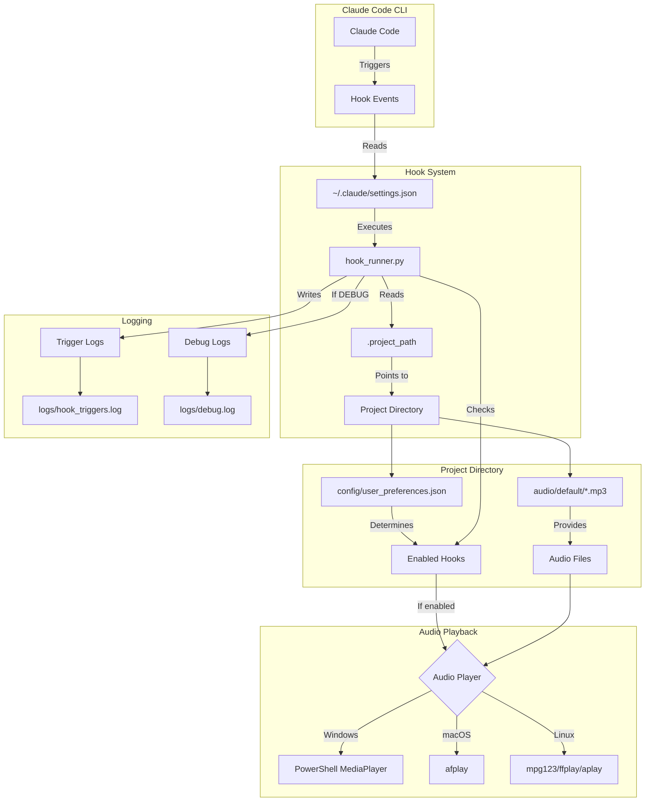
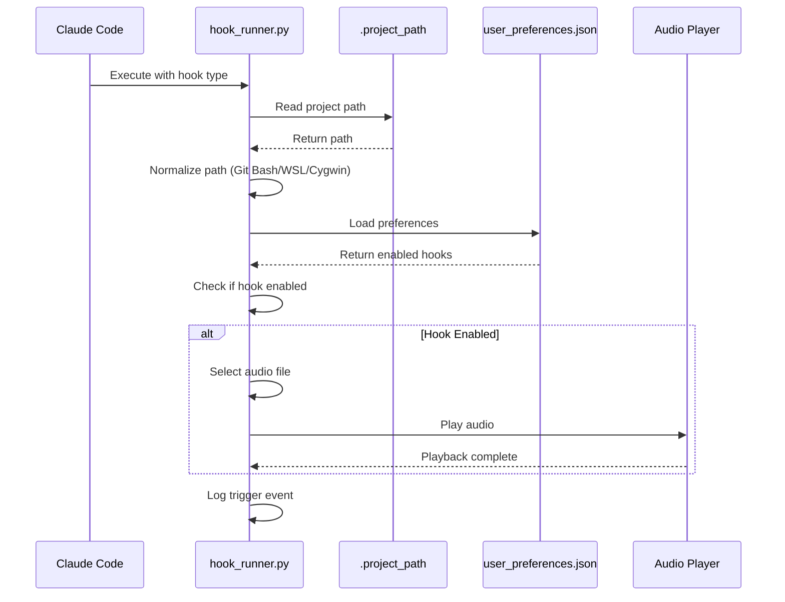
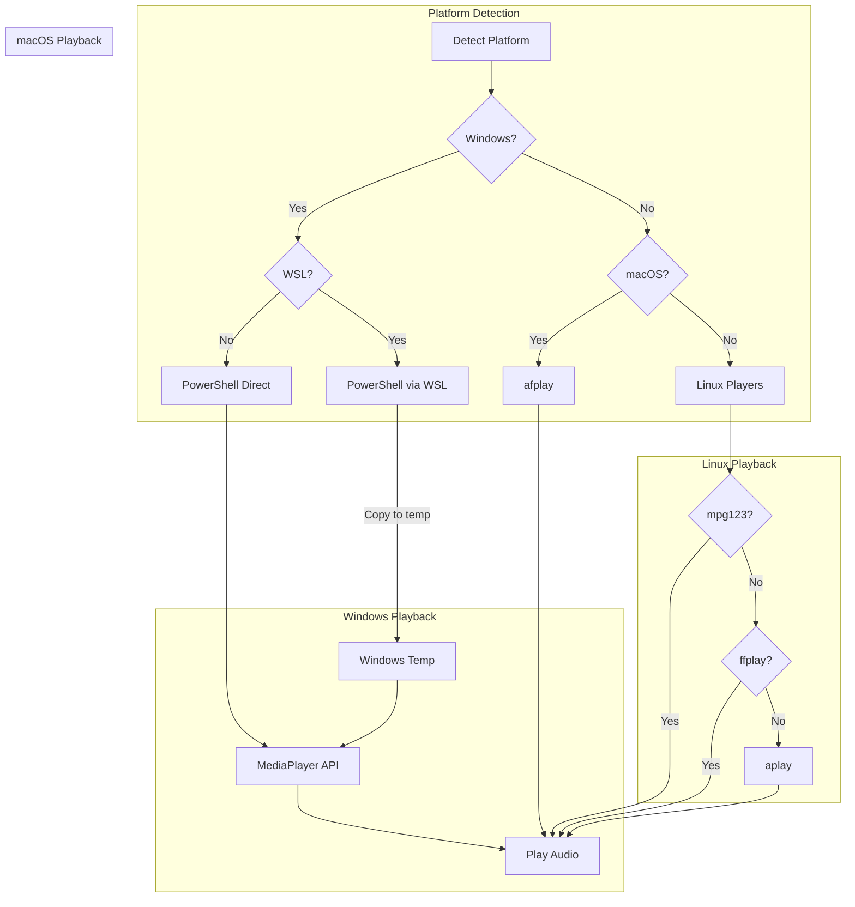
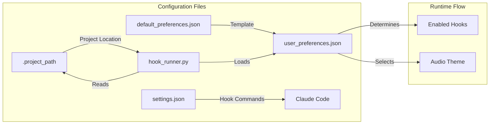
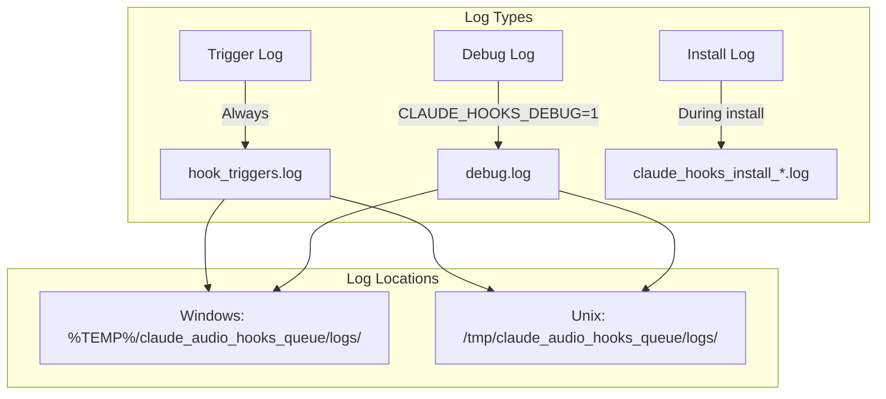
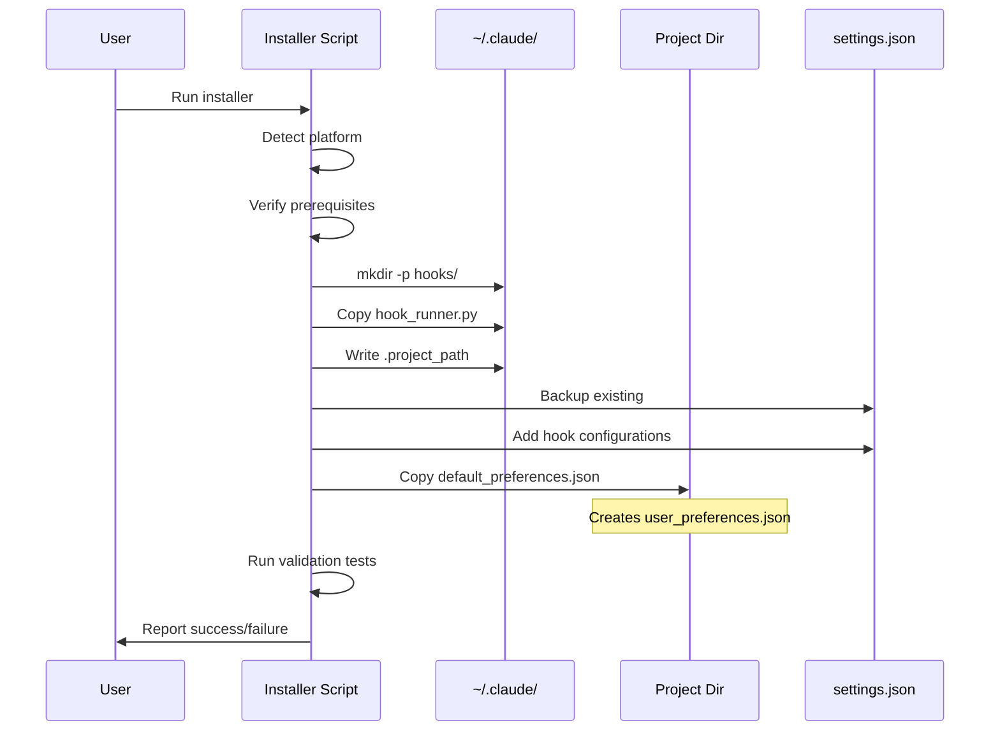

# System Architecture

> **Version:** 3.3.4 | **Last Updated:** 2025-12-22

This document explains the technical architecture of Claude Code Audio Hooks.

## System Overview



## Component Details

### 1. Claude Code CLI Integration

Claude Code provides a hooks system that executes commands at specific lifecycle events.

**Hook Configuration Location:** `~/.claude/settings.json`

```json
{
  "hooks": {
    "Stop": [
      {
        "hooks": [
          {
            "type": "command",
            "command": "py \"C:/Users/username/.claude/hooks/hook_runner.py\" stop"
          }
        ]
      }
    ]
  }
}
```

**Hook Types:**

| Hook | When Triggered | Use Case |
|------|---------------|----------|
| `Notification` | Authorization required | Alert user to approve action |
| `Stop` | Task completed | Notify task is done |
| `SessionStart` | New session begins | Mark session start |
| `SessionEnd` | Session closes | Mark session end |
| `PreToolUse` | Before tool execution | Pre-action notification |
| `PostToolUse` | After tool execution | Post-action notification |
| `UserPromptSubmit` | User sends message | Acknowledge input |
| `SubagentStop` | Background task done | Notify subagent completion |
| `PreCompact` | Context compaction | Notify memory optimization |

### 2. Hook Runner (Python)

**File:** `~/.claude/hooks/hook_runner.py`

The hook runner is the central execution component that:
1. Receives hook type as command-line argument
2. Reads project path from `.project_path`
3. Loads user preferences
4. Determines if hook is enabled
5. Selects appropriate audio file
6. Plays audio via platform-specific method



**Path Normalization:**

The hook runner handles multiple path formats:

| Source | Format | Example |
|--------|--------|---------|
| Git Bash | `/d/path/to/project` | `/d/github_repository/project` |
| WSL2 | `/mnt/c/path/to/project` | `/mnt/c/Users/name/project` |
| Cygwin | `/cygdrive/c/path` | `/cygdrive/c/Users/name/project` |
| Windows | `D:/path/to/project` | `D:/github_repository/project` |

### 3. Audio Playback System



**Windows PowerShell Command:**
```powershell
Add-Type -AssemblyName presentationCore
$mediaPlayer = New-Object System.Windows.Media.MediaPlayer
$mediaPlayer.Open("D:/project/audio/default/task-complete.mp3")
Start-Sleep -Milliseconds 500
$mediaPlayer.Play()
Start-Sleep -Seconds 2
$mediaPlayer.Stop()
$mediaPlayer.Close()
```

**macOS Command:**
```bash
afplay /path/to/audio/task-complete.mp3
```

**Linux Command:**
```bash
mpg123 -q /path/to/audio/task-complete.mp3
```

### 4. Configuration System



**user_preferences.json Structure:**
```json
{
  "_comment": "User preferences for audio hooks",
  "enabled_hooks": {
    "_description": "Enable/disable individual hooks",
    "notification": true,
    "stop": true,
    "subagent_stop": true,
    "session_start": false,
    "session_end": false,
    "pretooluse": false,
    "posttooluse": false,
    "userpromptsubmit": false,
    "precompact": false
  },
  "audio_settings": {
    "theme": "default",
    "volume": 1.0
  },
  "playback_settings": {
    "queue_enabled": true,
    "max_queue_size": 5,
    "debounce_ms": 500
  }
}
```

### 5. Logging System



**Trigger Log Format:**
```
2025-12-22 14:30:45 | stop | task-complete.mp3
2025-12-22 14:31:02 | notification | notification.mp3
```

**Debug Log Format:**
```
2025-12-22 14:30:45 | DEBUG | Hook triggered: stop
2025-12-22 14:30:45 | DEBUG | Project path: D:/github_repository/claude-code-audio-hooks
2025-12-22 14:30:45 | DEBUG | Audio file: D:/github_repository/claude-code-audio-hooks/audio/default/task-complete.mp3
2025-12-22 14:30:45 | DEBUG | Playing via PowerShell...
2025-12-22 14:30:47 | DEBUG | Playback complete
```

## Installation Architecture



## Cross-Platform Compatibility

### Platform Detection Logic

```mermaid
flowchart TD
    START[Start] --> CHECK_OS{platform.system()}

    CHECK_OS -->|Windows| CHECK_WSL{Check /proc/version}
    CHECK_OS -->|Linux| CHECK_WSL2{Contains 'microsoft'?}
    CHECK_OS -->|Darwin| MACOS[macOS Detected]

    CHECK_WSL -->|Contains 'microsoft'| WSL[WSL Detected]
    CHECK_WSL -->|Otherwise| CHECK_MSYS{OSTYPE contains 'msys'?}

    CHECK_WSL2 -->|Yes| WSL
    CHECK_WSL2 -->|No| LINUX[Linux Detected]

    CHECK_MSYS -->|Yes| GITBASH[Git Bash Detected]
    CHECK_MSYS -->|No| WINDOWS[Windows Native Detected]
```

### Path Handling by Platform

| Platform | Input Path | Normalized Path |
|----------|-----------|-----------------|
| Windows Native | `D:\project\audio` | `D:/project/audio` |
| Git Bash | `/d/project/audio` | `D:/project/audio` |
| WSL | `/mnt/c/project/audio` | `C:/project/audio` |
| Cygwin | `/cygdrive/c/project` | `C:/project` |
| macOS | `/Users/name/project` | `/Users/name/project` |
| Linux | `/home/user/project` | `/home/user/project` |

## Security Considerations

1. **No Network Access**: All operations are local
2. **No Elevated Privileges**: Runs as current user
3. **Safe File Operations**: Only reads config, writes logs
4. **PowerShell Escaping**: Special characters properly escaped
5. **Path Validation**: Paths validated before use

## Performance Characteristics

| Operation | Typical Duration |
|-----------|------------------|
| Hook trigger to audio start | < 500ms |
| Audio playback | 1-3 seconds |
| Log write | < 10ms |
| Config load | < 50ms |

## Dependencies

### Runtime Dependencies
- Python 3.6+ (all platforms)
- PowerShell 5.1+ (Windows)
- afplay (macOS, built-in)
- mpg123/ffplay/aplay (Linux, may need install)

### No External Python Packages Required
The hook runner uses only Python standard library modules:
- `os`, `sys`, `json`, `subprocess`
- `pathlib`, `platform`, `datetime`
- `shutil`, `tempfile`

---

*For installation instructions, see [INSTALLATION_GUIDE.md](INSTALLATION_GUIDE.md)*
*For troubleshooting, see [TROUBLESHOOTING.md](TROUBLESHOOTING.md)*
