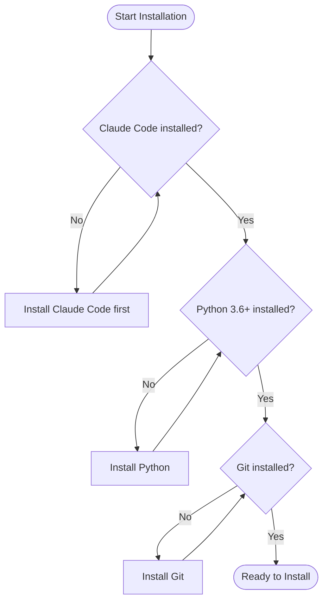
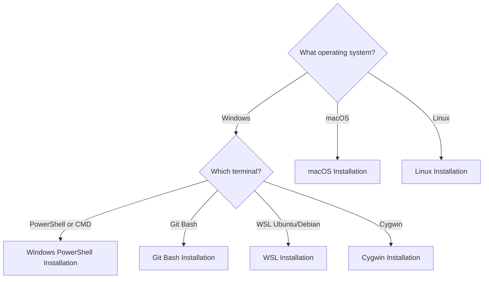
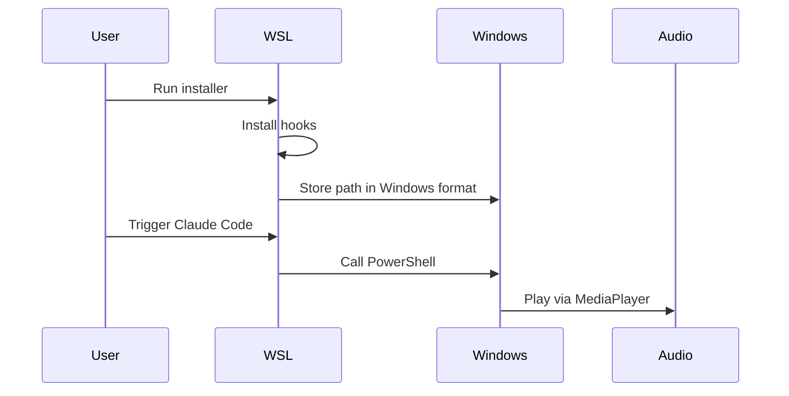
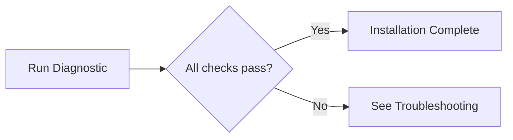

# Installation Guide

> **Version:** 3.3.4 | **Last Updated:** 2025-12-22

Complete installation guide for all platforms and environments.

## Prerequisites Check

Before installing, verify you have the required tools:



### Verification Commands

```bash
# Check Claude Code
claude --version
# Expected: claude X.X.X

# Check Python (try all variants)
python3 --version   # Linux/macOS
python --version    # May work
py --version        # Windows Python Launcher

# Check Git
git --version
```

### Installing Missing Prerequisites

| Tool | Windows | macOS | Linux |
|------|---------|-------|-------|
| Claude Code | [Download](https://docs.anthropic.com/claude/docs/claude-code) | [Download](https://docs.anthropic.com/claude/docs/claude-code) | [Download](https://docs.anthropic.com/claude/docs/claude-code) |
| Python | [python.org](https://www.python.org/downloads/) | `brew install python3` | `sudo apt install python3` |
| Git | [git-scm.com](https://git-scm.com/) | `brew install git` | `sudo apt install git` |

---

## Platform Selection Guide



---

## Windows PowerShell Installation

**Best for:** Windows users who don't use Git Bash

### Step 1: Clone Repository

```powershell
# Navigate to desired location
cd $HOME\Documents

# Clone repository
git clone https://github.com/ChanMeng666/claude-code-audio-hooks.git
cd claude-code-audio-hooks
```

### Step 2: Run PowerShell Installer

```powershell
# Run installer
.\scripts\install-windows.ps1

# Or for non-interactive mode
.\scripts\install-windows.ps1 -NonInteractive
```

### Step 3: Verify Installation

```powershell
# Check hook runner installed
Test-Path "$env:USERPROFILE\.claude\hooks\hook_runner.py"
# Should return: True

# Check settings configured
Get-Content "$env:USERPROFILE\.claude\settings.json" | Select-String "hook_runner"
# Should show hook configurations
```

### Step 4: Restart and Test

```powershell
# Close and reopen PowerShell, then:
claude "What is 2+2?"
# Listen for audio when response completes
```

---

## Windows Git Bash Installation

**Best for:** Windows users with Git Bash installed

### Step 1: Clone Repository

```bash
# Navigate to desired location
cd ~/Documents

# Clone repository
git clone https://github.com/ChanMeng666/claude-code-audio-hooks.git
cd claude-code-audio-hooks
```

### Step 2: Run Bash Installer

```bash
# Run installer
bash scripts/install-complete.sh

# Or for non-interactive mode
bash scripts/install-complete.sh --yes
```

### Step 3: Verify Installation

```bash
# Check hook runner installed
ls -la ~/.claude/hooks/hook_runner.py

# Check project path (should be Windows format)
cat ~/.claude/hooks/.project_path
# Should show: D:/path/to/claude-code-audio-hooks
```

### Step 4: Restart and Test

```bash
# Close and reopen Git Bash, then:
claude "What is 2+2?"
```

---

## WSL Installation

**Best for:** Windows users who prefer Linux environment



### Step 1: Clone Repository

```bash
# In WSL terminal
cd ~

# Clone repository
git clone https://github.com/ChanMeng666/claude-code-audio-hooks.git
cd claude-code-audio-hooks
```

### Step 2: Run Installer

```bash
bash scripts/install-complete.sh
```

### Step 3: Verify PowerShell Access

```bash
# Test PowerShell is accessible from WSL
powershell.exe -Command "Write-Host 'PowerShell works'"
# Should output: PowerShell works
```

### Step 4: Test Audio

```bash
# Test audio playback
python scripts/diagnose.py --test-audio
```

### WSL-Specific Notes

- Audio plays through Windows, not WSL
- Audio files are automatically copied to Windows temp directory
- PowerShell must be accessible from WSL path

---

## macOS Installation

**Best for:** All macOS users

### Step 1: Clone Repository

```bash
cd ~

git clone https://github.com/ChanMeng666/claude-code-audio-hooks.git
cd claude-code-audio-hooks
```

### Step 2: Run Installer

```bash
bash scripts/install-complete.sh
```

### Step 3: Verify Installation

```bash
# Check hook runner
ls -la ~/.claude/hooks/hook_runner.py

# Check afplay (built-in audio player)
which afplay
# Should show: /usr/bin/afplay
```

### Step 4: Test

```bash
# Restart terminal, then:
claude "What is 2+2?"
```

---

## Linux Installation

**Best for:** Linux desktop users

### Step 1: Install Audio Player

```bash
# Ubuntu/Debian
sudo apt-get update
sudo apt-get install mpg123

# Fedora
sudo dnf install mpg123

# Arch Linux
sudo pacman -S mpg123

# Verify installation
mpg123 --version
```

### Step 2: Clone Repository

```bash
cd ~

git clone https://github.com/ChanMeng666/claude-code-audio-hooks.git
cd claude-code-audio-hooks
```

### Step 3: Run Installer

```bash
bash scripts/install-complete.sh
```

### Step 4: Test Audio

```bash
# Test audio directly
mpg123 ~/claude-code-audio-hooks/audio/default/task-complete.mp3

# Or use diagnostic tool
python scripts/diagnose.py --test-audio
```

---

## Post-Installation Configuration

### Configure Enabled Hooks

After installation, you can customize which hooks trigger audio:

```bash
# Interactive configuration
bash scripts/configure.sh

# Or edit directly
nano ~/claude-code-audio-hooks/config/user_preferences.json
```

### Recommended Configuration

```json
{
  "enabled_hooks": {
    "notification": true,    // KEEP: Important alerts
    "stop": true,            // KEEP: Task completion
    "subagent_stop": true,   // KEEP: Background tasks
    "session_start": false,  // Optional
    "session_end": false,    // Optional
    "pretooluse": false,     // DISABLE: Too noisy
    "posttooluse": false,    // DISABLE: Too noisy
    "userpromptsubmit": false,
    "precompact": false
  }
}
```

### Enable Debug Logging

For troubleshooting, enable debug mode:

```bash
# Bash/Zsh (add to ~/.bashrc or ~/.zshrc for persistence)
export CLAUDE_HOOKS_DEBUG=1

# PowerShell (add to $PROFILE for persistence)
$env:CLAUDE_HOOKS_DEBUG = "1"
```

---

## Installation Verification

### Quick Verification



```bash
# Run full diagnostic
python scripts/diagnose.py -v --test-audio
```

### Manual Verification Checklist

| Check | Command | Expected |
|-------|---------|----------|
| Hook runner exists | `ls ~/.claude/hooks/hook_runner.py` | File exists |
| Project path saved | `cat ~/.claude/hooks/.project_path` | Valid path |
| Settings configured | `grep hook_runner ~/.claude/settings.json` | Hook entries found |
| User preferences | `cat config/user_preferences.json` | JSON with enabled_hooks |
| Audio files | `ls audio/default/*.mp3 \| wc -l` | 9 files |

---

## Upgrading from Previous Versions

### From v3.x

```bash
cd claude-code-audio-hooks
git pull origin master
bash scripts/install-complete.sh
```

### From v2.x or v1.x

```bash
# Uninstall old version first
bash scripts/uninstall.sh

# Get latest code
git pull origin master

# Fresh install
bash scripts/install-complete.sh
```

---

## Uninstallation

```bash
# Interactive uninstall
bash scripts/uninstall.sh

# Non-interactive uninstall
bash scripts/uninstall.sh --yes
```

This removes:
- Hook configurations from `~/.claude/settings.json`
- Hook scripts from `~/.claude/hooks/`
- Keeps project directory and audio files

---

## Next Steps

1. **Customize audio files**: Replace MP3 files in `audio/default/`
2. **Configure hooks**: Run `bash scripts/configure.sh`
3. **Enable debug logging**: Set `CLAUDE_HOOKS_DEBUG=1`
4. **Report issues**: [GitHub Issues](https://github.com/ChanMeng666/claude-code-audio-hooks/issues)

---

*For troubleshooting, see [TROUBLESHOOTING.md](TROUBLESHOOTING.md)*
*For architecture details, see [ARCHITECTURE.md](ARCHITECTURE.md)*
