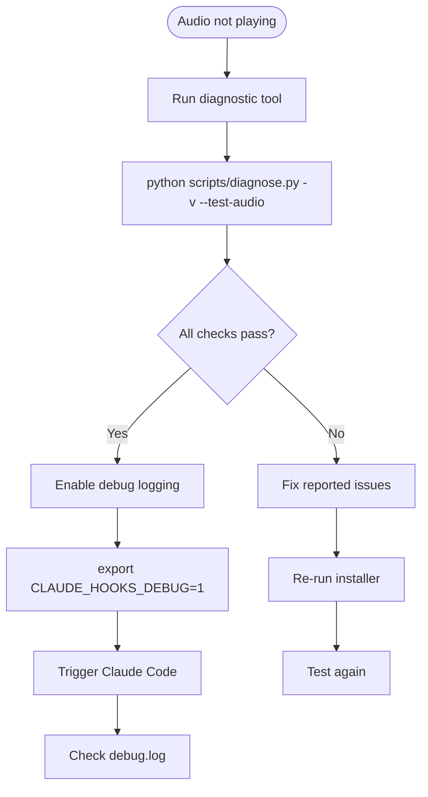
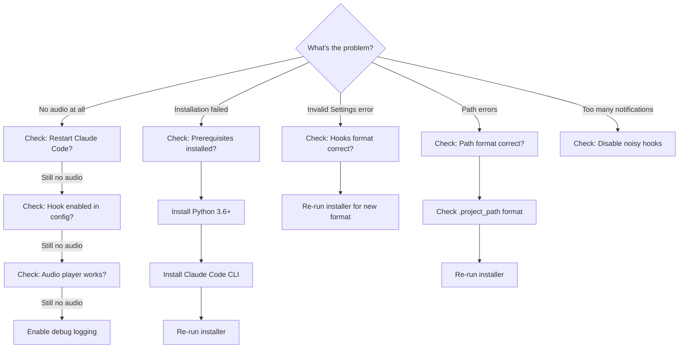
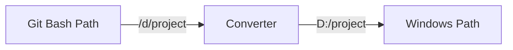
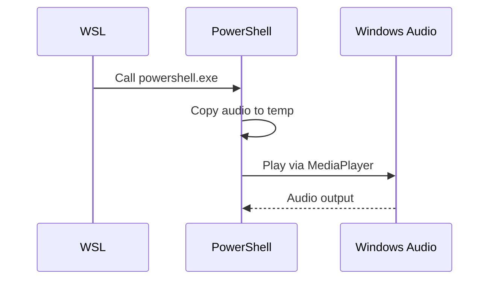
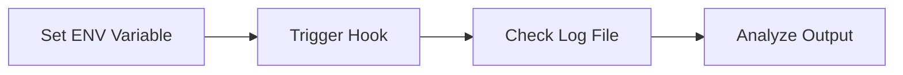
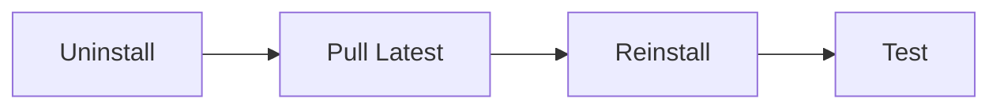

# Troubleshooting Guide

> **Version:** 3.3.4 | **Last Updated:** 2025-12-22

Complete troubleshooting guide for all platforms and common issues.

## Quick Diagnostic



**Run this first:**
```bash
python scripts/diagnose.py -v --test-audio
```

---

## Issue Decision Tree



---

## Common Issues by Platform

### All Platforms

#### Issue: "No audio after installation"

**Symptom:** Installation completes but no audio plays.

**Diagnosis:**
```bash
# Check if hooks are registered
grep -A5 "Stop" ~/.claude/settings.json

# Check if hook runner exists
ls -la ~/.claude/hooks/hook_runner.py

# Check if project path is set
cat ~/.claude/hooks/.project_path
```

**Solutions:**

1. **Restart Claude Code** (most common fix)
   ```bash
   # Close terminal completely
   # Reopen and test
   claude "test"
   ```

2. **Verify hook is enabled**
   ```bash
   cat config/user_preferences.json | grep stop
   # Should show: "stop": true
   ```

3. **Check audio file exists**
   ```bash
   ls -la audio/default/task-complete.mp3
   ```

---

### Windows-Specific Issues

#### Issue: "Path errors in Git Bash"

**Symptom:** Errors about file not found, path contains `/d/` format.



**Diagnosis:**
```bash
# Check .project_path format
cat ~/.claude/hooks/.project_path
# Should be: D:/path/to/project (NOT /d/path/to/project)
```

**Solution:**
```bash
# Re-run installer - it auto-converts paths
bash scripts/install-complete.sh
```

#### Issue: "PowerShell execution policy"

**Symptom:** Cannot run `.ps1` scripts.

**Solution:**
```powershell
# Run as Administrator
Set-ExecutionPolicy -ExecutionPolicy RemoteSigned -Scope CurrentUser

# Or bypass for single run
powershell.exe -ExecutionPolicy Bypass -File .\scripts\install-windows.ps1
```

#### Issue: "Python not found on Windows"

**Symptom:** `python` or `python3` command not found.

**Solution:**
```powershell
# Use Python Launcher (installed with Python)
py --version

# If not working, reinstall Python from python.org
# IMPORTANT: Check "Add Python to PATH" during installation
```

---

### WSL-Specific Issues

#### Issue: "No audio in WSL"

**Symptom:** Hooks trigger but no sound.



**Diagnosis:**
```bash
# Test PowerShell access from WSL
powershell.exe -Command "Write-Host 'Works'"

# Test audio playback
powershell.exe -Command "Add-Type -AssemblyName presentationCore; Write-Host 'Audio API available'"
```

**Solutions:**

1. **Check PowerShell is accessible:**
   ```bash
   which powershell.exe
   # Should show a path
   ```

2. **Check Windows audio service:**
   ```powershell
   # In PowerShell (not WSL)
   Get-Service AudioSrv
   # Should show: Running
   ```

3. **Test audio in Windows directly:**
   ```powershell
   # In PowerShell
   $player = New-Object System.Media.SoundPlayer
   $player.SoundLocation = "C:\Windows\Media\chimes.wav"
   $player.Play()
   ```

---

### macOS-Specific Issues

#### Issue: "afplay not working"

**Symptom:** No audio, afplay errors.

**Diagnosis:**
```bash
# Test afplay directly
afplay /System/Library/Sounds/Ping.aiff

# Check audio output
system_profiler SPAudioDataType
```

**Solutions:**

1. **Check System Preferences > Sound > Output**
2. **Try with explicit path:**
   ```bash
   /usr/bin/afplay ~/claude-code-audio-hooks/audio/default/task-complete.mp3
   ```

---

### Linux-Specific Issues

#### Issue: "No audio player found"

**Symptom:** Installation warns about missing audio player.

**Solution:**
```bash
# Install mpg123 (recommended)
sudo apt-get update
sudo apt-get install mpg123

# Or install alternatives
sudo apt-get install ffmpeg    # Provides ffplay
sudo apt-get install alsa-utils # Provides aplay

# Verify
mpg123 --version
```

#### Issue: "Audio plays but no sound"

**Symptom:** Command runs without error but no audio output.

**Diagnosis:**
```bash
# Check PulseAudio
pactl info

# List audio sinks
pactl list sinks short

# Check volume
amixer get Master
```

**Solutions:**

1. **Unmute and set volume:**
   ```bash
   amixer set Master unmute
   amixer set Master 80%
   ```

2. **Check PulseAudio is running:**
   ```bash
   pulseaudio --check
   pulseaudio --start
   ```

---

## Debug Logging

### Enable Debug Mode



**Bash/Zsh/Git Bash:**
```bash
export CLAUDE_HOOKS_DEBUG=1
```

**PowerShell:**
```powershell
$env:CLAUDE_HOOKS_DEBUG = "1"
```

**Make permanent:**
```bash
# Add to ~/.bashrc or ~/.zshrc
echo 'export CLAUDE_HOOKS_DEBUG=1' >> ~/.bashrc

# Or for PowerShell, add to $PROFILE
Add-Content $PROFILE '$env:CLAUDE_HOOKS_DEBUG = "1"'
```

### Log File Locations

| Platform | Path |
|----------|------|
| Windows | `%TEMP%\claude_audio_hooks_queue\logs\debug.log` |
| Linux/macOS | `/tmp/claude_audio_hooks_queue/logs/debug.log` |
| WSL | `/tmp/claude_audio_hooks_queue/logs/debug.log` |

### Reading Debug Logs

```bash
# View last 50 lines
tail -50 /tmp/claude_audio_hooks_queue/logs/debug.log

# Follow in real-time
tail -f /tmp/claude_audio_hooks_queue/logs/debug.log

# Windows PowerShell
Get-Content "$env:TEMP\claude_audio_hooks_queue\logs\debug.log" -Tail 50
```

### Debug Log Format

```
2025-12-22 14:30:45 | DEBUG | ========================================
2025-12-22 14:30:45 | DEBUG | Hook triggered: stop
2025-12-22 14:30:45 | DEBUG | Platform: Windows
2025-12-22 14:30:45 | DEBUG | Python: 3.11.0
2025-12-22 14:30:45 | DEBUG | Working dir: C:\Users\name\.claude\hooks
2025-12-22 14:30:45 | DEBUG | Reading .project_path...
2025-12-22 14:30:45 | DEBUG | Raw path: D:/github_repository/claude-code-audio-hooks
2025-12-22 14:30:45 | DEBUG | Normalized path: D:/github_repository/claude-code-audio-hooks
2025-12-22 14:30:45 | DEBUG | Loading user_preferences.json...
2025-12-22 14:30:45 | DEBUG | Hook 'stop' enabled: True
2025-12-22 14:30:45 | DEBUG | Audio file: D:/github_repository/claude-code-audio-hooks/audio/default/task-complete.mp3
2025-12-22 14:30:45 | DEBUG | Playing via PowerShell...
2025-12-22 14:30:47 | DEBUG | Playback completed successfully
```

### Common Debug Patterns

| Log Entry | Meaning | Solution |
|-----------|---------|----------|
| `Hook 'stop' enabled: False` | Hook disabled | Enable in user_preferences.json |
| `Audio file not found` | Missing MP3 | Check audio/default/ directory |
| `Path not found: /d/...` | Wrong path format | Re-run installer |
| `PowerShell error` | Windows audio issue | Check Windows audio service |

---

## Reinstallation

When troubleshooting fails, a clean reinstall often helps:



```bash
# 1. Uninstall
bash scripts/uninstall.sh --yes

# 2. Get latest code
git pull origin master

# 3. Fresh install
bash scripts/install-complete.sh  # or install-windows.ps1

# 4. Restart and test
# Close terminal, reopen, then:
claude "test"
```

---

## Collecting Information for Bug Reports

If you need to report an issue, collect this information:

```bash
# System info
uname -a                          # OS details
python3 --version                 # Python version
claude --version                  # Claude Code version

# Installation status
python scripts/diagnose.py -v     # Full diagnostic

# Debug logs (if enabled)
cat /tmp/claude_audio_hooks_queue/logs/debug.log

# Configuration
cat ~/.claude/hooks/.project_path
cat config/user_preferences.json
cat ~/.claude/settings.json | grep -A10 hooks
```

**Include in bug report:**
1. Operating system and version
2. Shell type (PowerShell, Git Bash, zsh, etc.)
3. Diagnostic tool output
4. Debug log (last 100 lines)
5. Steps to reproduce

---

## Getting Help

1. **Run diagnostics first:**
   ```bash
   python scripts/diagnose.py -v --test-audio
   ```

2. **Check existing issues:**
   [GitHub Issues](https://github.com/ChanMeng666/claude-code-audio-hooks/issues)

3. **Create new issue with:**
   - Diagnostic output
   - Debug logs
   - System information
   - Steps to reproduce

---

*For installation help, see [INSTALLATION_GUIDE.md](INSTALLATION_GUIDE.md)*
*For architecture details, see [ARCHITECTURE.md](ARCHITECTURE.md)*
